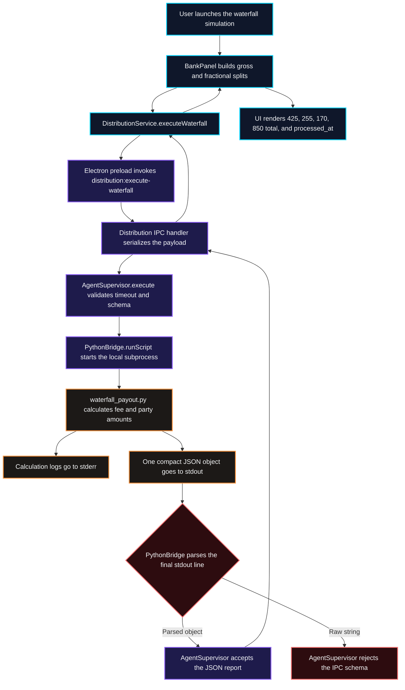

# ISSUE-1124 Waterfall Bridge Contract

This diagram records the bounded local payout-simulation path and the stdout
contract that connects the Python engine to Electron. It does not represent a
live payout, payment-provider call, or movement of money.

## Transition breakdown

1. `BankPanel` converts the visible 50/30/20 percentages to fractional splits
   and asks `DistributionService` to execute the local simulation.
2. The preload API sends the request to the main-process distribution handler,
   which serializes the data as the Python script's single payload argument.
3. `AgentSupervisor` applies the timeout and delegates execution to
   `PythonBridge`, which starts `execution/finance/waterfall_payout.py`.
4. The script deducts the 15% platform fee from $1,000 and divides the remaining
   $850 into $425, $255, and $170. Diagnostic logging uses stderr.
5. The final report is emitted as one compact JSON line on stdout because
   `PythonBridge` parses only the final stdout line.
6. `AgentSupervisor` accepts the parsed object, and the report returns through
   IPC to the renderer. A raw string is rejected instead of being treated as a
   valid payout report.
7. The UI renders the three numeric distributions, the $850 total, and the
   `processed_at` timestamp. This path is a local calculation only.
