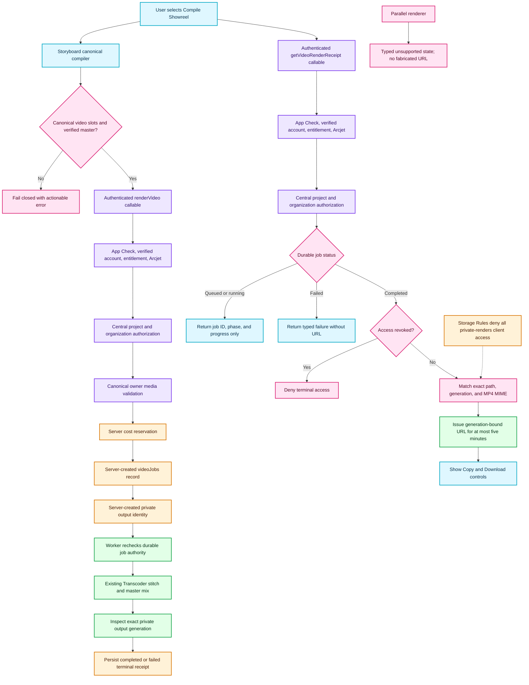

# ISSUE-1157 Private Server Render Authority

This map documents the Phase A local contract. It separates renderer intent from
server admission, provider authority, private object identity, and terminal-only
authorized readback. Phase B public sharing and deployed acceptance remain open.

## Transition breakdown

1. `StoryboardTimeline` compiles the storyboard against the active app project.
   Every rendered slot must carry a `gs://` canonical source, and exactly one
   verified canonical master must remain attached; preview and blob URLs never
   become render authority.
2. `RenderService` sends only composition input plus the active project and
   organization IDs to `renderVideo`. The client cannot select a bucket, object
   path, privacy policy, or provider configuration.
3. The callable applies App Check, verified authentication, server entitlement,
   and Arcjet protection before centralized project authorization, media
   verification, cost reservation, durable job creation, and queue dispatch.
4. The server creates the private identity from authenticated owner, authorized
   project, and server-created job ID. The worker rechecks that identity against
   the durable job before the existing Transcoder contract can be invoked.
5. A successful worker inspects the exact expected MP4, persists its generation,
   and marks the job completed. Failures persist a typed terminal failure without
   an asset URL.
6. Receipt reads repeat request protection and centralized project authorization.
   Queued/running/failed states never inspect or sign Storage; a completed,
   non-revoked job must match its exact expected object path, generation, and MIME.
7. The maximum-five-minute signed URL is returned only after those checks.
   Storyboard UI displays job lifecycle throughout and renders Copy/Download only
   for the completed receipt.
8. Storage Rules independently deny all direct client operations on
   `private-renders`. Parallel output remains typed unsupported until a separate
   server-owned chunk/stitch receipt contract exists.
