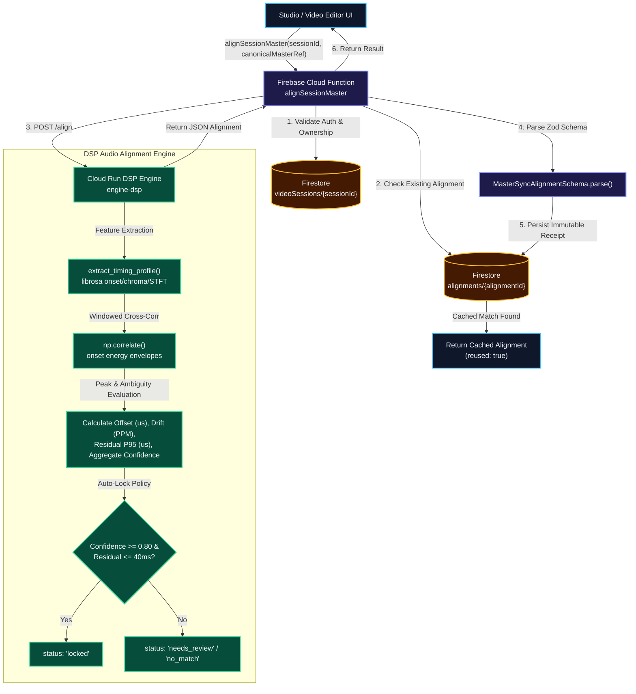

# ISSUE-1176 Multitrack & Sync Alignment Workflow

## Step-by-Step Transition Breakdown

1. **Client Request**: Studio UI invokes `alignSessionMaster` Cloud Function with `sessionId` and `canonicalMasterRef`.
2. **Auth & Cache Lookup**: Firebase Function checks session ownership in Firestore and searches for an existing `MasterSyncAlignment` receipt for idempotent reuse.
3. **DSP Processing**: If not cached, the function posts to `engine-dsp` Cloud Run worker.
4. **DSP Onset & Cross-Correlation**: `AudioAlignmentPipeline` computes librosa STFT/onset features and windowed cross-correlation.
5. **Confidence Gating**: Evaluates offset, drift, and residual error. Auto-locks if confidence >= 0.80 and residual <= 40ms.
6. **Receipt Persistence & Return**: Validates output against `MasterSyncAlignmentSchema`, saves receipt to Firestore, and returns alignment result to the client.
