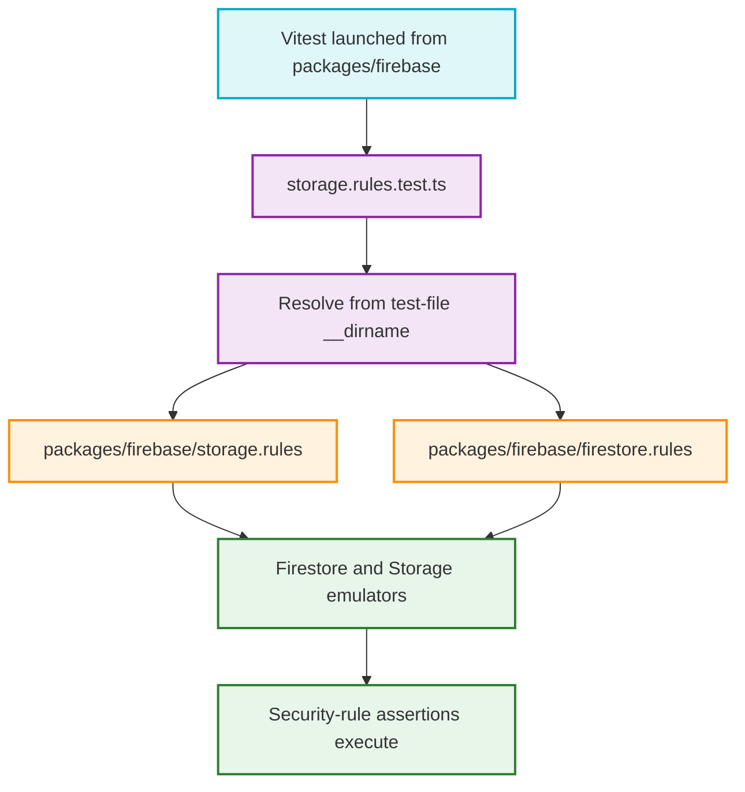

# ISSUE-1221 Security Rules Test Path

This flow shows how the Firebase package security-rules tests locate their rules files independently of the directory from which Vitest is launched.

## Step-by-Step Transition Breakdown

1. Vitest runs with `packages/firebase` as its working directory.
2. The test resolves both rules files from its own stable directory, `packages/firebase/src/test/security`, rather than the caller-controlled working directory.
3. `../../../storage.rules` and `../../../firestore.rules` reach the package-level rules files without duplicating `packages/firebase`.
4. The Firebase test environment loads those rules into the local emulators.
5. The focused suites execute their real security assertions instead of failing during file loading with `ENOENT`.
