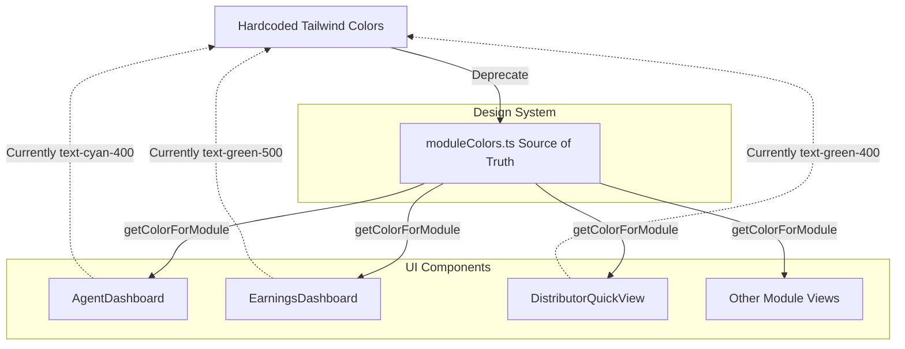

# Architecture Flowchart: Global Theme Migration (ISSUE-1272)

## Migration Strategy

The goal is to eliminate hardcoded, drift-prone accent colors (`text-cyan-500`, `bg-emerald-500/20`, etc.) from all module dashboards and replace them with the canonical design system values powered by `getColorForModule(moduleId)`.

1. **Audit & Identify:** Isolate all instances of hardcoded color classes across the ~25 module screens.
2. **Dynamic Theming:** Inject the appropriate `getColorForModule(moduleId)` or CSS variables into the styling, either via inline styles for specific elements or by utilizing CSS variables if we map the Tailwind classes to CSS vars defined per-module.
3. **Verify:** Confirm that each module visually matches its corresponding sidebar highlight without regression.

## Step-by-Step Transition Breakdown

1. **Deprecation Phase**: Hardcoded Tailwind color classes in UI components are identified and deprecated.
2. **Centralized Tokens**: `moduleColors.ts` defines canonical module theme tokens as the single source of truth.
3. **Component Hydration**: `AgentDashboard`, `EarningsDashboard`, `DistributorQuickView`, and other module views call `getColorForModule(moduleId)` to receive consistent theme styles.
4. **Visual Verification**: Component accent colors dynamically match sidebar highlights.
