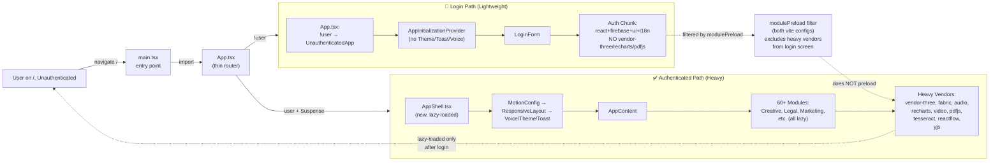

# ISSUE-549 + ISSUE-564 Execution Flowchart

## Architecture: Split Auth from Authenticated Shell

## Step-by-Step Transition Breakdown

1. **ISSUE-564 (Artifact Untrack)** — Quick git hygiene (~5 min)
   - `git rm --cached artifacts/live-agent-daisy-chain/`
   - Update .gitignore
   - Verify no breakage
   - Commit

2. **ISSUE-549 Step 1 (Create AppShell.tsx)** — Move 400+ lines from App.tsx
   - Extract `lazyWithRetry`, all lazy modules, MODULE_COMPONENTS
   - Extract COMMERCIAL_MODULES, useOnboardingRedirect, GuestGate, UpgradeGate, ModuleRenderer
   - Extract AppContent with all providers
   - Wrap in MotionConfig/ResponsiveLayout/Voice/Theme/Toast

3. **ISSUE-549 Step 2 (Slim App.tsx)** — Thin router
   - Add `const AppShell = lazy(...)` 
   - New return: publicLegalPage ? … : authLoading ? … : !user ? UnauthenticatedApp : `<Suspense><AppShell/></Suspense>`
   - Remove ALL heavy imports → run lint to confirm clean

4. **ISSUE-549 Step 3 (modulePreload)** — Both vite configs
   - Add `modulePreload.resolveDependencies` filter to packages/renderer/vite.config.ts
   - Add same to electron.vite.config.ts
   - Excludes vendor-three/fabric/audio/recharts/video/pdfjs/tesseract/reactflow/yjs

5. **ISSUE-549 Step 4 (Verify Gate)** — All checks must pass
   - `npm run typecheck` ✓
   - `npm run lint` ✓ (no disables)
   - `npm run build:studio` ✓
   - Inspect dist/renderer/index.html for modulepreload links (no heavy vendors) ✓
   - `npm test -- --run` (App/login/founder specs) ✓
   - Before/after gzip numbers recorded ✓

6. **Update ISSUE-549 + ISSUE-564** in ledger
   - Mark ISSUE-564 ✅ FIXED
   - Mark ISSUE-549 ✅ FIXED (with before/after numbers)
   - Commit: `feat(perf): split auth bundle from app shell (ISSUE-549, ISSUE-564)`

## Rationale

**ISSUE-549 Root Cause:** `main.tsx:19` eagerly imports `App`. `App.tsx` statically imports ~60 authenticated-shell modules at the top. Login screen downloads the whole app (~1.38 MB gzip).

**Why split works:** Auth path pulls ONLY react + firebase + ui + i18n + LoginForm (no Sidebar, RightPanel, providers, agents, modules). `AppShell` (40+ modules) loads only after login via `lazy()`. `modulePreload` filter ensures heavy vendors (Three.js, Recharts, Fabric, etc.) do NOT preload on the login page.

**Before/After Expected:** Auth chunk shrinks by ~400-500 KB gzip (drops all the 60 modules + their vendors). Full authenticated shell still lazy-loads on login (no breaking change to signed-in experience).

**ISSUE-564:** Artifact files written at E2E runtime were tracked in git. Every local run rewrites them → dirty tree → Stop-hook checkpoints churn them. Untracking stops the treadmill; files still written to disk.
