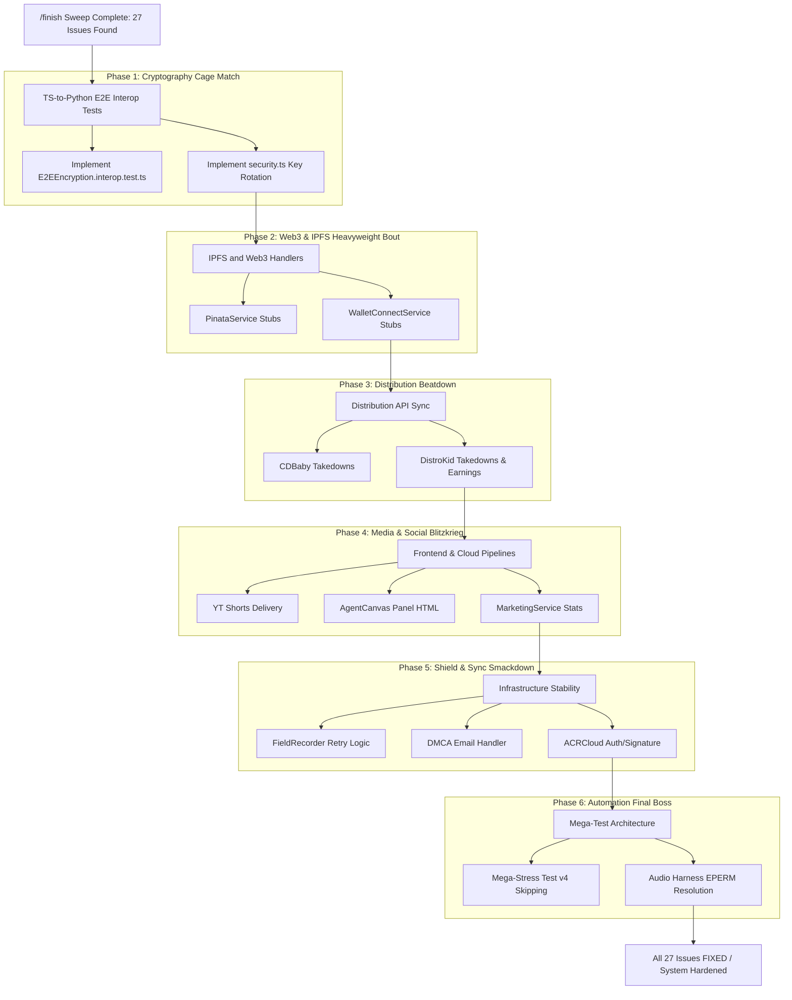

# The 27-Issue Championship Gauntlet

This diagram maps out the multi-phase execution strategy for clearing the 27 new issues discovered by the `/finish` sweep. It represents the structural breakdown of the technical debt clearance.

## Transition Breakdown

1. **Start:** The `/finish` tool scans the codebase and identifies 27 open debt issues.
2. **Phase 1 (Cryptography):** E2E encryption and key rotation logic are finalized, which forms the secure communication baseline.
3. **Phase 2 (Web3 & IPFS):** Handlers for decentralization, stubs, and integrations are addressed.
4. **Phase 3 (Distribution):** Earnings and takedown APIs are synchronized to allow releases to go live.
5. **Phase 4 (Media & UI):** Visual components, marketing stats, and media assets are corrected.
6. **Phase 5 (Infrastructure):** ACRCloud integration, email retry systems, and retry logic are hardened.
7. **Phase 6 (Testing):** EPERM locks are resolved, and final mega-stress testing completes the gauntlet to reach a fully hardened system state.
