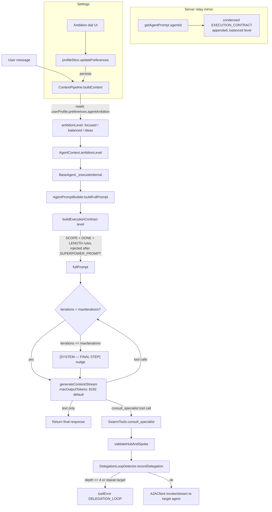

# Judgment Layer — macro flow

Behavioral constraint layer for the in-product specialist agents: scope discipline, stop-when-done, verbosity cap, and a user-owned ambition dial. See the approved plan for full detail.

## Transition Breakdown
1. **User message processing**: User message goes to `ContextPipeline.buildContext` which reads `agentAmbition` setting.
2. **Context assembly**: The `ambitionLevel` is added to `AgentContext` and passed to `BaseAgent._executeInternal`.
3. **Prompt construction**: `AgentPromptBuilder` creates `ExecutionContract` rules and injects them into the final prompt.
4. **Execution loop**: The agent iterates until max iterations, either generating tool calls or a text-only final response.
5. **Swarm delegation**: If `consult_specialist` is called, loop detection rules are verified before invoking `A2AClient`.

## Notes
- **Single injection point:** `AgentPromptBuilder.buildFullPrompt` is the only assembly choke point for every agent execution (client-side), so the Execution Contract lands there once — not duplicated per agent persona.
- **Fine-tuned agents:** the full prompt (contract included) rides as user content into fine-tuned Vertex endpoints — no retraining needed for the constraint to take effect.
- **Ambition dial:** user preference → `ContextPipeline` → `AgentContext.ambitionLevel` → contract wording (0/2/4 offered ideas). No silent auto-tuning; growth is consent-based (deferred v1.5 roadmap item, not built now).
- **A2A hop cap:** `consult_specialist` now shares `DelegationLoopDetector` with `delegate_task`, closing the previously uncapped swarm-delegation path.
- **Server relay** (`packages/firebase/src/relay/agentPrompts.ts`) is hand-synced by existing convention and ships a fixed "balanced" contract (no profile access there).
