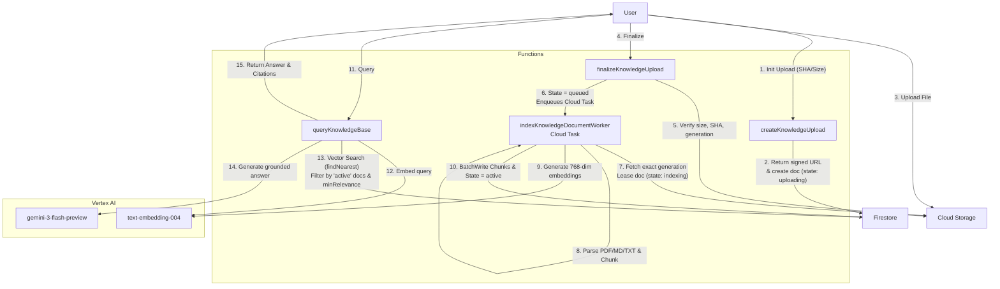

# Knowledge (RAG) Pipeline Architecture

## Transition Breakdown
This flowchart maps the strict, durable, and idempotent Knowledge pipeline for indii, fixing issues 1248-1253.
- **Upload Phase**: Enforces strict metadata constraints and validates SHA-256 and byte sizes to prevent rogue uploads.
- **Task Dispatch**: Replaces a dangling promise with a reliable Cloud Task dispatch for the index worker.
- **Worker Phase**: Uses a transactional lease to enter the `indexing` state and a `BulkWriter` for atomic promotion to `active`.
- **Query Phase**: Utilizes exact document state filtering and a `minRelevance` threshold on the cosine distance before passing citations to Vertex AI for answer generation.
