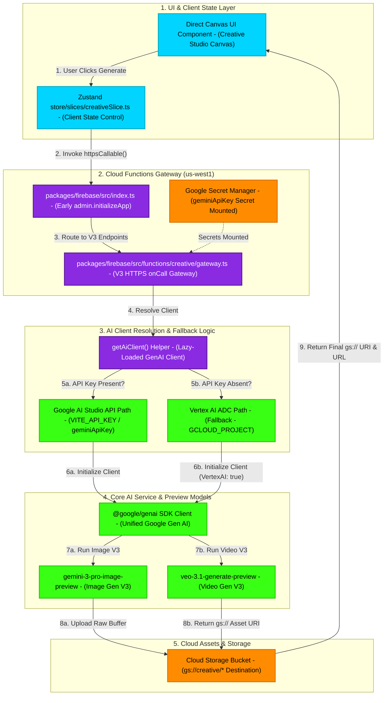

# Live Media Generation V3 Pipeline Flowchart

This flowchart maps the end-to-end technical architecture of the **Live Media Generation V3 Pipeline** for the indii Creative Studio. It illustrates how user prompt actions trigger Zustand state transitions, execute lazy-loaded Cloud Functions, dynamically resolve Google AI Studio API Keys vs. Vertex AI fallback paths, and return final high-fidelity media assets.

## Mermaid Architecture Diagram

## Detailed Transition Breakdown

1. **User Action & State Transition:**
   - The user opens the **Direct Canvas UI** in the Creative Studio, writes a prompt (e.g., *"A futuristic floating island, synthwave style"*), selects options (aspect ratio, length), and clicks **Generate**.
   - The **Zustand Store (`creativeSlice.ts`)** updates state to track the generation loading process and immediately calls the live Cloud Function `generateImageV3` or `generateVideoV3` using the Firebase `httpsCallable` interface.

2. **Cloud Functions Gateway & Cold-Start Optimization:**
   - The request hits `packages/firebase/src/index.ts`. Due to early `admin.initializeApp()` invocation, all required services are fully booted cleanly without race conditions.
   - The request is routed to the V3 HTTPS onCall functions defined in `packages/firebase/src/functions/creative/gateway.ts`. The Google Secret Manager secret `geminiApiKey` is automatically mounted and exposed to this runtime environment.

3. **Lazy-Loaded GenAI Client Resolution (`getAiClient`):**
   - The gateway lazily calls `getAiClient()` to instantiate the **`GoogleGenAI`** SDK client.
   - **Key Priority Check:** It checks if a valid `geminiApiKey` secret exists. 
     - **Path A (Preferred):** If a secret key exists, it initializes `new GoogleGenAI({ apiKey })` to use standard Google AI Studio APIs globally, bypassing region availability locks.
     - **Path B (Fallback):** If no secret key is found (or it contains a placeholder), it falls back to the Google Cloud Application Default Credentials (ADC) path, initializing the client with `vertexai: true` using the active project and location.

4. **Media Generation Execution:**
   - The initialized GenAI client triggers the corresponding preview models (`gemini-3-pro-image-preview` for images and `veo-3.1-generate-preview` for videos).
   - Once generated, the raw buffers are written and uploaded directly to secure directories in the **Cloud Storage Bucket** (`gs://creative/{userId}/*`).

5. **Client Update & Asset Handback:**
   - The final, secure Cloud Storage `gs://` URI and signed HTTP download URL are returned in the function response to the **Direct Canvas UI** where the state is updated, loading is resolved, and the new visual asset renders instantly.
