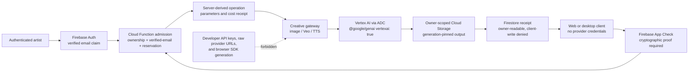

# Live Media Generation V3 — Vertex-Only Admission Flow

This is the authoritative runtime design for Creative Studio image, video, and
speech generation. It replaces the retired Developer API / API-key fallback
diagram. No browser, Electron renderer, or MCP caller receives a Google AI
provider credential.

## Transition Breakdown

1. Firebase Auth and cryptographic App Check independently establish the
   caller and client integrity before media generation is admitted.
2. The backend derives ownership, verified-email status, entitlement, final
   media parameters, and the operation cost; browser estimates are advisory.
3. The Creative gateway submits only an allowlisted operation to Vertex AI
   through Application Default Credentials.
4. Vertex output is written to an owner-scoped, generation-pinned Cloud
   Storage object rather than returned as a public provider URL.
5. Firestore records an owner-readable, client-write-denied receipt that
   resolves the operation and its private artifact.
6. Developer API keys, browser SDK provider calls, raw provider URLs, and
   unsupported RAG fallbacks fail closed instead of creating a second billing
   or authorization path.

## Non-negotiable security properties

1. **Vertex-only provider boundary:** backend services use the shared
   `getVertexAIClient()` factory with Application Default Credentials. A
   Developer API key is not a fallback.
2. **Authenticated admission:** creative generation requires Firebase Auth and
   the authoritative `email_verified` token claim. Client profile fields cannot
   grant a tier, Founder status, credits, or entitlement.
3. **App Check is proof, not a header:** values such as a User-Agent or
   `x-app-client-type` can never authenticate a desktop client. Until a
   cryptographic desktop attestation path exists, an unproven desktop request
   fails closed.
4. **Cost authority remains server-side:** a client may request an operation,
   but the gateway computes its final media parameters and rejects a missing or
   mismatched reservation. Browser `skipCostCheck` and `forceBypass` controls
   are not accepted.
5. **No music generation:** a creator's own canonical master can be referenced
   for timing and mix policy, but it is never sent to a music-generation model.
6. **RAG migration is explicit:** the retired Developer Files API proxy returns
   a structured 503 until an owner-scoped Cloud Storage + Vertex RAG path is
   implemented. A disabled capability is safer than an invisible second billing
   and authorization boundary.

## Remaining runtime gates

- Deploy and live-verify the amended Firestore rules and Vertex-only functions.
- Build a legitimate desktop attestation/provider flow before re-enabling
  protected Electron calls.
- Replace client-estimate admission with a versioned server pricing catalog for
  every billable operation.
- Implement the owner-scoped Vertex RAG replacement before restoring document
  retrieval.
