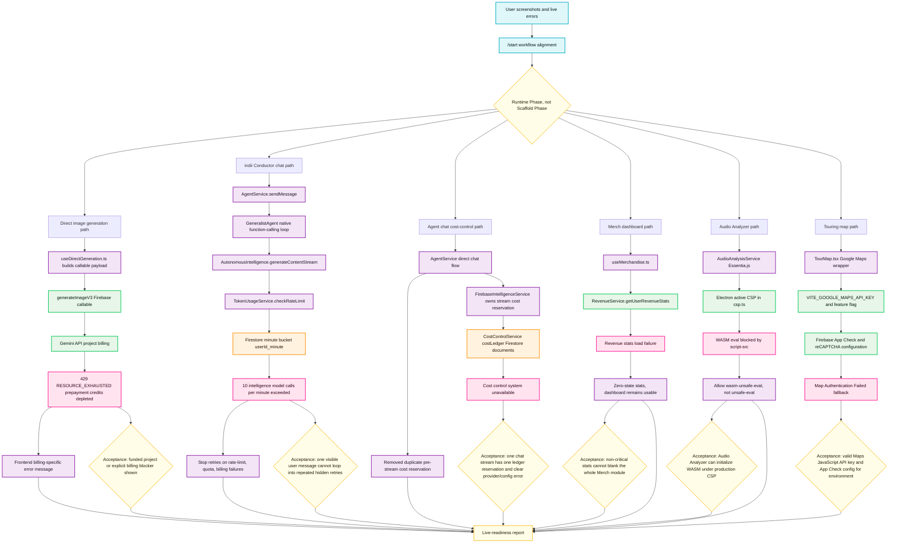

# Live Provider Blockers Startup Flowchart

This diagram maps the current Runtime Phase incidents reported on 2026-06-02: Gemini image generation billing exhaustion, indii Conductor per-minute rate-limit amplification, cost-control ledger failure, merch stats degradation, Audio Analyzer WASM CSP failure, and Google Maps authentication failure. It is intentionally a live-readiness map, not a CI-only validation map.

## Transition Breakdown

1. The user-reported screenshots are the source of truth for this startup: one image-generation provider error, one Conductor rate-limit error after a visible `hi`, one agent side-panel cost-control failure after `hey`, one Merch dashboard revenue-stats failure, one Audio Analyzer CSP failure, and one map authentication fallback.
2. The direct image path starts in `packages/renderer/src/modules/creative/hooks/useDirectGeneration.ts`, calls the `generateImageV3` Firebase callable, and then depends on the Gemini API project billing state. A local payload-shape pass does not prove that the provider account has credits.
3. The Conductor path starts in `packages/renderer/src/services/agent/AgentService.ts`, routes through `packages/renderer/src/services/agent/specialists/GeneralistAgent.ts`, and can make multiple internal model calls for one visible message. Each model call hits `TokenUsageService.checkRateLimit`, which increments a Firestore minute bucket.
4. The immediate Conductor code risk is retry amplification: if a rate-limit failure is treated as non-fatal inside the function-calling loop, one visible user message can produce repeated hidden attempts before surfacing one fatal message.
5. The agent cost-control path previously reserved stream cost in `AgentService.handleDirectChatFlow` and then reserved again inside `FirebaseIntelligenceService.generateContentStream`. The direct-chat flow now delegates the reservation to the Intelligence service so one visible chat stream has one cost-ledger preflight.
6. The Merch dashboard path now treats revenue stats as non-critical: if `RevenueService.getUserRevenueStats` fails or times out, the dashboard uses zero-state stats instead of rendering the module-wide fatal error screen.
7. The Audio Analyzer path depends on Essentia.js WASM. The active Electron CSP must include `wasm-unsafe-eval` in production `script-src`; adding broad `unsafe-eval` would be an unnecessary security regression.
8. The map path starts in `packages/renderer/src/modules/touring/components/TourMap.tsx`. The fallback indicates Google Maps loaded far enough to report authentication failure, which points to API key, Maps JavaScript API enablement, referrer restrictions, App Check, or reCAPTCHA configuration for the current environment.
9. The Runtime Phase acceptance criteria are provider-backed: funded Gemini billing or honest billing-blocker UI, no repeated hidden Conductor retries after a rate-limit failure, one cost reservation per chat stream, dashboards degrade rather than blanking on non-critical stats failures, WASM libraries are allowed by production CSP, and Maps/App Check configuration is verified for the running environment.
