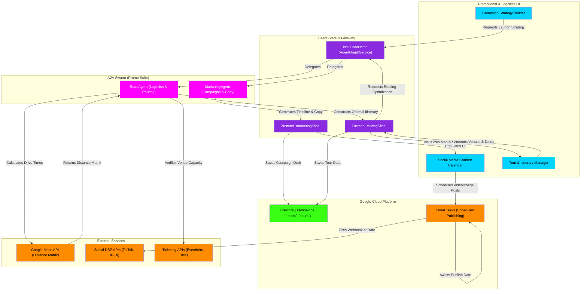

# Marketing, Social & Touring Flowchart

This flowchart maps the logistics and promotional engine of indii. It details how the MarketingAgent designs campaigns, how the Social module schedules cross-platform publishing, and how the RoadAgent handles tour logistics, routing, and real-time mapping via external APIs.

## Transition Breakdown

1. **Campaign Ideation:** The user requests a release strategy in the **Campaign Strategy Builder**. The **indii Conductor** routes this intent to the **MarketingAgent**.
2. **Strategy Generation:** The **MarketingAgent** uses the active project's context (e.g., genre, target audience) to generate a multi-week timeline of promotional beats, writing the necessary copy and tagging required assets. This data populates the **Zustand `marketingSlice`** and is saved as a draft in **Firestore**.
3. **Social Scheduling:** The generated timeline is rendered on the **Social Media Content Calendar**. When the user attaches assets (from the Creative/Video studios) and clicks "Schedule", the system queues the posts in Google **Cloud Tasks**.
4. **Automated Publishing:** **Cloud Tasks** holds the payload in a sleeping state until the exact scheduled timestamp. It then fires a secure webhook to the respective **Social DSP APIs** (TikTok, Instagram, X) to publish the content autonomously.
5. **Tour Planning:** In the **Tour & Itinerary Manager**, the user inputs a list of target cities or venues. This updates the **Zustand `touringSlice`** and triggers a request to the **RoadAgent**.
6. **Logistics Optimization:** The **RoadAgent** executes external function calls to the **Google Maps API (Distance Matrix)** to calculate exact drive times between venues. It may also cross-reference the **Ticketing APIs** to verify venue capacities or hold statuses.
7. **Itinerary Finalization:** The RoadAgent returns a geographically and temporally optimized itinerary. This data updates the `touringSlice`, saves to **Firestore**, and is visually rendered as an interactive map and day sheet for the user in the **TourManager** UI.
