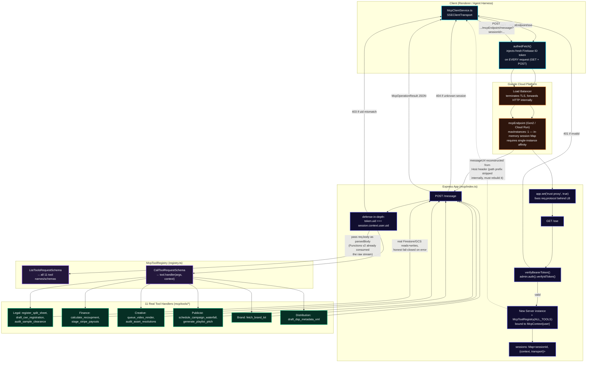

# MCP Tool Endpoint — Live Architecture (mcpEndpoint)

Documents the real, live-verified request flow for `mcpEndpoint` (the Cloud Function serving indii's 11 remote agent tools — split sheets, CWR, Stripe payout staging, campaign waterfall, canvas render, sample clearance, etc.), as of the 2026-07-21 live-verification session (ISSUE-1092).

**Why this exists:** the file previously exporting `mcpEndpoint` (`packages/firebase/src/mcp/index.ts`) was a stale, pre-registry relic — one hardcoded tool, no auth, a single shared `Server` instance. `mcp/registry.ts`'s `McpToolRegistry` (the real, per-session, auth-aware dispatcher) existed but was imported by zero files. This diagram reflects the rewired, actually-deployed, actually-tested architecture — not the aspirational one described in earlier session notes.

## Transition Breakdown

Key architectural facts, each verified live, 2026-07-21:

1. **Gen2, not Gen1.** Gen1 Cloud Functions hard-kill any HTTP response at their execution ceiling (60s default / 540s max) regardless of `timeoutSeconds` — fundamentally incompatible with SSE, which must stay open indefinitely. Confirmed live: auth succeeded, session established, then a 502 "Truncated response body" at exactly the ceiling. Gen1→Gen2 requires `firebase functions:delete <name> --region=<region>` first — `firebase deploy` refuses an in-place upgrade.
2. **`maxInstances: 1` is deliberate, not an oversight.** Sessions live in an in-process `Map`. Cloud Run doesn't guarantee session affinity across instances by default, so a `/message` POST could land on a different instance than the one holding its session and 404. Capping at one instance guarantees every request reaches the same `Map`; Node's event loop still serves many concurrent SSE connections fine on that one instance. The real long-term fix for horizontal scale is moving session state to Firestore/Redis.
3. **`trust proxy` is required**, not optional. Cloud Functions/Cloud Run terminates TLS at the load balancer and forwards internally over plain HTTP — `req.protocol` reports `'http'` for a real HTTPS caller unless Express is told to trust `X-Forwarded-Proto`.
4. **The function-name path prefix (`/mcpEndpoint`) is stripped before Express ever sees the request** — `req.originalUrl`/`req.baseUrl` cannot be used to reconstruct a client-facing callback URL. It has to be rebuilt from the `Host` header pattern instead.
5. **`req.body` must be passed through explicitly** to any library (like the MCP SDK's `SSEServerTransport.handlePostMessage`) that tries to read the raw request stream itself — Firebase Functions v2's `onRequest` already consumed it.
6. **Auth is a two-layer check:** the SSE handshake verifies the caller's ID token once to establish `McpContext`; every subsequent `/message` POST re-verifies its own bearer token and requires the same `uid` as the session — defense against a leaked/guessed `sessionId` hijacking another user's authenticated session.

See ERROR_LEDGER.md (2026-07-21, "Wiring a Cloud Functions SSE Endpoint") for the full defect-by-defect narrative, and `.agent/test_ledger/OPEN_ISSUES_V2.md` ISSUE-1092 for the commit chain.
