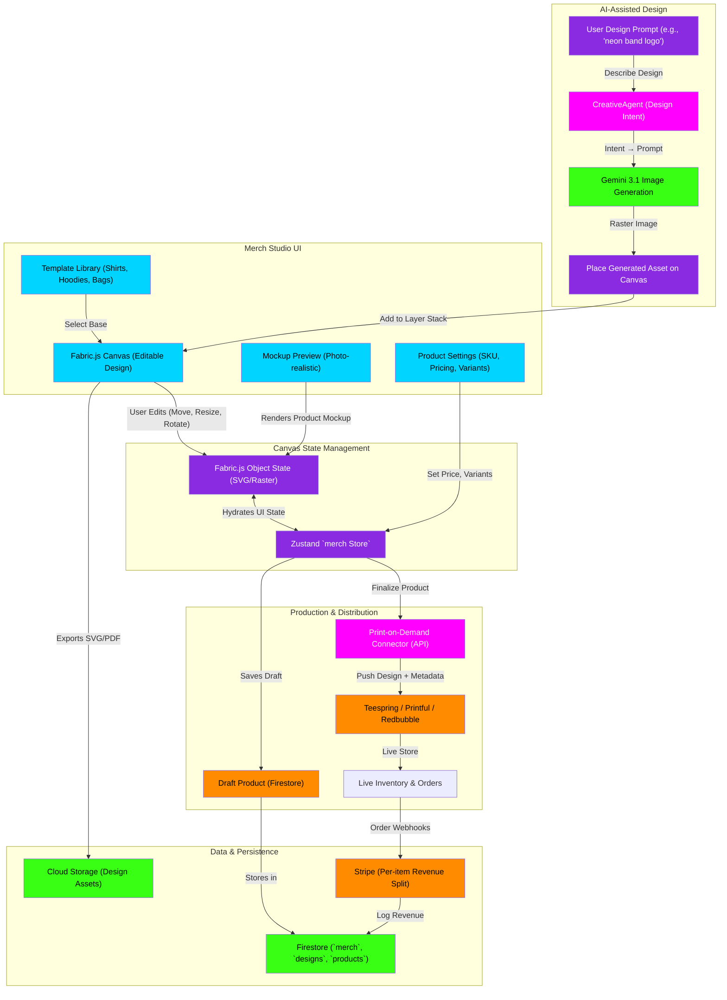

# Merch Studio Pipeline Flowchart

This flowchart maps the indii Merch Studio—a Fabric.js-powered design canvas where artists create merchandise designs with AI-assisted mockups, and ship products via print-on-demand distributors (Teespring, Printful, etc.).

## Transition Breakdown

1. **Template Selection:** User selects a merch template (T-shirt, hoodie, tote bag) from the **Template Library**. Fabric.js is initialized with the template's dimensions and layers.

2. **AI-Assisted Design:** User enters a design prompt (e.g., "neon geometric band logo"). The **CreativeAgent** interprets this intent and sends a refined prompt to **Gemini 3.1 Pro Image** for generation.

3. **Asset Placement:** The generated image is placed on the canvas as a **Fabric.js raster object**. User can position, resize, rotate, or layer it with other elements.

4. **Real-time Mockup:** The **Mockup Preview** renders the design on a photo-realistic product image (e.g., shirt on a model), updating live as the user edits.

5. **Design Persistence:** Edits to **Fabric.js objects** sync to the **Zustand `merch Store`**. The entire design state is serializable to JSON and saved to **Firestore** as a draft.

6. **Product Configuration:** User enters **Product Settings** (price per unit, available sizes/colors, SKU) via a side panel.

7. **POD Integration:** Once finalized, the **POD Connector** packages the design (SVG/high-res export) and metadata into the specific format required by the **Print-on-Demand Service** (Teespring, Printful, etc.).

8. **Live Store:** The product goes live in the service's inventory. When customers order, webhooks return order data to **Stripe** for revenue tracking and split calculation.

9. **Revenue Attribution:** **Firestore** records all transactions, attributing revenue correctly to the artist account and any collaborators.

