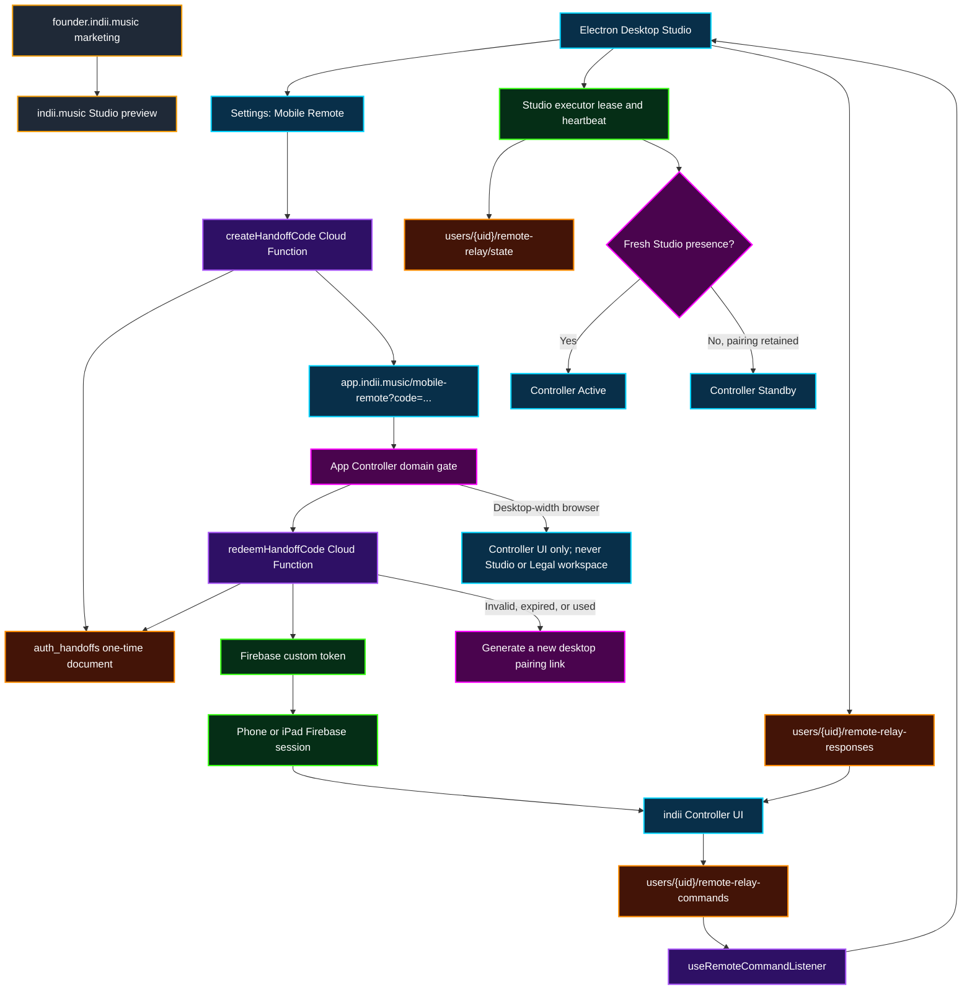

# Mobile Controller One-Click Handoff

This flowchart defines the domain, authentication, presence, and execution boundaries for pairing an iPhone or iPad Controller with the native Electron Studio. The experience is intentionally link-first: the desktop generates a short-lived QR/link, the mobile device redeems it once, and the authenticated Controller then reconnects through the durable Firestore relay without becoming a Studio executor.

## Transition breakdown

1. The native Electron Studio is the only Studio executor. In `Settings → Mobile Remote`, `RemoteSection.tsx` requests a pairing code using the desktop user’s current Firebase ID token.
2. `createHandoffCode` verifies that ID token, creates a random 64-character hexadecimal code, and stores a five-minute `auth_handoffs/{code}` document containing the owner identity and expiry.
3. The desktop renders a QR/link targeting `https://app.indii.music/mobile-remote?code=...`. The user opens that link on an iPhone or iPad; manual code entry is a fallback, not the primary flow.
4. `App.tsx` treats the entire `app.indii.music` host as Controller-only and renders `MobileRemote` before the ordinary authentication gate. This ordering is required because the link itself establishes the phone’s Firebase session.
5. `MobileRemote.tsx` validates the code format, calls `redeemHandoffCode`, signs in with the returned custom token, and removes the spent code from the visible URL. Redemption atomically deletes the handoff document, so the link is single-use.
6. Invalid, expired, already-used, or failed handoffs enter an explicit recovery state instructing the user to generate a new link from Desktop Studio. The system never silently falls through to a disabled controller.
7. After authentication, the Controller subscribes to `users/{uid}/remote-relay/state`. The Electron Studio publishes a server-verified executor lease and heartbeat; the Controller cannot publish or claim Studio presence.
8. Controller commands are written to the owner-scoped command queue. `useRemoteCommandListener` claims Studio-targeted work, executes it in Electron, and writes owner-scoped responses for the phone.
9. Pairing and presence are separate. A stale or sleeping desktop changes the Controller from Active to Standby but does not revoke the authenticated pairing. A fresh Studio heartbeat restores Active automatically.
10. Desktop-width visits to `app.indii.music`, including stale paths such as `/legal`, are canonicalized to the Controller. They never expose the regular browser Studio or make the Controller an executor.

## Failure and retry rules

1. If Electron authentication reports a blocked HTTP referrer, the desktop request identity must remain the canonical Studio origin (`https://indii.music/`), never the Founder marketing origin.
2. If a pairing code fails, generate a new link. Do not reuse, extend, or reconstruct the one-time code.
3. If the Controller is paired but the Studio is unavailable, retain pairing and show Standby. Retry the state subscription or wake the Electron app; do not force another authentication handoff.
4. The two-strike pivot rule applies to transport failures: after two failed fixes to the Firestore relay path, stop tuning heartbeat timing and inspect the executor lease, owner identity, and security-rule contract as separate boundaries.
