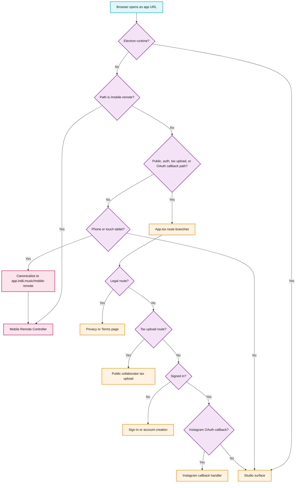

# Mobile Public Route Precedence

This map defines the renderer bootstrap decision that keeps public and authentication routes reachable on phones without weakening the explicit Mobile Remote Controller boundary.

## Transition breakdown

1. `App.tsx` supplies `pathname`, Electron state, and the result of `isRemoteSurfaceDevice()` to `shouldUseMobileRemoteSurface()`.
2. Electron remains a Studio surface regardless of viewport heuristics. In web runtimes, an explicit `/mobile-remote` pathname has the highest route priority and always selects the Controller.
3. The routing policy next checks the normalized pathname. Legal pages (`/privacy`, `/legal/privacy`, `/terms`, `/legal/terms`), the collaborator `/tax-form-upload` route, authentication aliases (`/login`, `/signin`, `/signup`, `/register`), and provider callback paths under `/auth/{provider}/callback` are protected from device-based Controller routing.
4. Only paths that are neither explicit Controller nor protected app routes reach device classification. Phones and touch-capable tablets select the Controller and, outside local development, are canonicalized to `https://app.indii.music/mobile-remote` while preserving search and hash parameters.
5. Protected paths continue through the existing `App.tsx` branch order: legal content and collaborator upload bypass authentication, signed-out auth paths render `LoginForm`, and the signed-in Instagram callback renders its callback handler.
6. `isStudioExecutorSurface()` consumes the final surface decision. Controller pages remain command producers and cannot publish Studio presence; the routing exemption changes presentation reachability only, not remote-command trust boundaries.

## Verification contract

- Pure routing tests cover every protected path, trailing-slash normalization, explicit Controller precedence, ordinary phone app routing, Electron, and desktop web.
- A real browser pass uses a phone viewport against the local production-shaped renderer: protected routes must keep their pathname and must not show “Studio Disconnected”; `/mobile-remote` must still render the Controller.
- Desktop checks confirm the same protected content remains reachable and normal Studio routing is unchanged.
