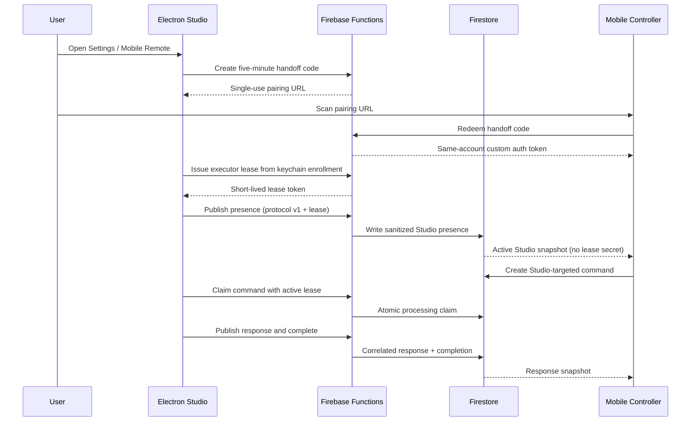
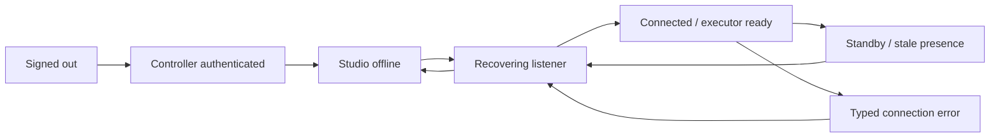

# Mobile Remote Cloud Relay

```mermaid
sequenceDiagram
    participant U as User
    participant S as Electron Studio
    participant F as Firebase Functions
    participant D as Firestore
    participant C as Mobile Controller

    U->>S: Open Settings / Mobile Remote
    S->>F: Create five-minute handoff code
    F-->>S: Single-use pairing URL
    U->>C: Scan pairing URL
    C->>F: Redeem handoff code
    F-->>C: Same-account custom auth token
    S->>F: Issue executor lease from keychain enrollment
    F-->>S: Short-lived lease token
    S->>F: Publish presence (protocol v1 + lease)
    F->>D: Write sanitized Studio presence
    D-->>C: Active Studio snapshot (no lease secret)
    C->>D: Create Studio-targeted command
    S->>F: Claim command with active lease
    F->>D: Atomic processing claim
    S->>F: Publish response and complete
    F->>D: Correlated response + completion
    D-->>C: Response snapshot
```

## State transitions

```mermaid
flowchart LR
    SignedOut["Signed out"] --> Authenticated["Controller authenticated"]
    Authenticated --> Offline["Studio offline"]
    Offline --> Recovering["Recovering listener"]
    Recovering --> Offline
    Recovering --> Connected["Connected / executor ready"]
    Connected --> Standby["Standby / stale presence"]
    Standby --> Recovering
    Connected --> Error["Typed connection error"]
    Error --> Recovering
```

The server-owned presence boundary preserves the desktop/controller trust separation even though both devices use the same account.
