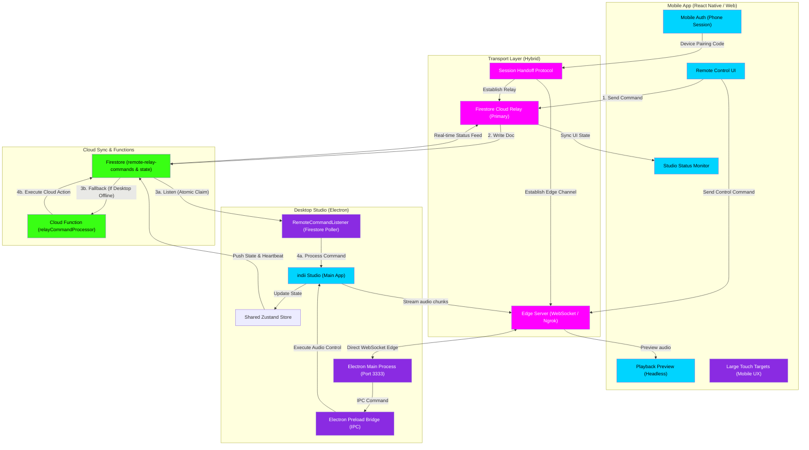

# Mobile Remote (indiiREMOTE) Hybrid Flowchart

This flowchart maps **indiiREMOTE**—a companion mobile app that lets artists control and monitor the Indii Studio remotely from phone/tablet. It utilizes a **Hybrid Architecture** communicating both via **Firestore Cloud Relay** (for robust command/state sync) and **Direct WebSocket/Ngrok** (for high-bandwidth edge tasks).

## Transition Breakdown

1. **Hybrid Path:** The indiiREMOTE architecture uses **Firestore Cloud Relay** as the primary source of truth for command routing and state synchronization, while simultaneously maintaining a direct **WebSocket Edge Connection** (via Ngrok) for low-latency asset streaming.

2. **Device Pairing:** User opens **indiiREMOTE** on mobile and enters a **pairing code** from the desktop app. This initiates the **Session Handoff Protocol**.

3. **Secure Channel:** A **WebSocket connection** (direct or via Ngrok) or **Firestore Cloud Relay** is established between mobile and desktop, encrypted using standard secure protocols.

4. **Command Flow:** User taps a button on **Remote Control UI** (e.g., "Start Recording"). This sends a message via WebSocket to the **Electron Main Process**, which invokes handlers via the **Preload Bridge** (IPC).

5. **State Update:** The command executes in the desktop **Studio App**, updating the **Shared Zustand Store**. This change is automatically synced to **Firestore**.

6. **Live Feedback:** The **Status Monitor** subscribes to real-time updates. As the desktop app processes the command, status changes (e.g., "Recording in progress") are emitted back to the mobile app via WebSocket.

7. **Atomic Claim System:** Both the **LocalListener** on the active desktop app and the **RelayProcessor** (Cloud Function) listen to Firestore. The desktop app claims and processes the command if online; otherwise, the cloud function processes it.

8. **State Update & Feedback:** As commands execute, status changes (e.g., "Recording in progress") are updated in Firestore and pushed in real-time to the mobile **Status Monitor**.

9. **Edge Playback (WebSocket):** For high-bandwidth tasks like audio/video preview, the mobile app communicates directly with the **Electron Main Process** over the encrypted WebSocket tunnel, bypassing the database layer.
