# Mobile Remote (indiiREMOTE) Flow Flowchart

This flowchart maps **indiiREMOTE**—a companion mobile app that lets artists control and monitor the Indii Studio remotely from phone/tablet. It communicates with the desktop Electron app via WebSocket, enabling real-time control, playback preview, and status monitoring.

```mermaid
graph TD
    %% Mobile Layer
    subgraph Mobile ["Mobile App (React Native / Web)"]
        MobileAuth["Mobile Auth (Phone Session)"]
        RemoteUI["Remote Control UI"]
        StatusMonitor["Studio Status Monitor"]
        PlaybackControls["Playback Preview (Headless)"]
        TouchTargets["Large Touch Targets (Mobile UX)"]
    end

    %% Communication
    subgraph Transport ["Real-time Transport Layer"]
        CloudRelay["Firestore Cloud Relay (Ubiquitous)"]
        WebSocket["Edge Server (WebSocket / Ngrok)"]
        SessionSync["Session Handoff Protocol"]
        Encryption["End-to-End Encryption (A2A Protocol)"]
    end

    %% Desktop Electron
    subgraph Desktop ["Desktop Studio (Electron)"]
        DesktopApp["indii Studio (Main App)"]
        ElectronMainProcess["Electron Main Process"]
        PreloadBridge["Electron Preload Bridge (IPC)"]
    end

    %% Data Sync
    subgraph Sync ["Data Synchronization"]
        SharedState["Shared Zustand Store"]
        ProjectState["Project State (Sync Queue)"]
        AssetQueue["Asset Queue (Upload/Download)"]
    end

    %% Backend
    subgraph Cloud ["Cloud Sync & Persistence"]
        FirestoreSync["Firestore Real-time Listener"]
        FSState["Firestore (`projects` collection)"]
        CloudStorage["Cloud Storage (Assets)"]
    end

    %% Flow
    MobileAuth -->|"Device Pairing Code"| SessionSync
    SessionSync -->|"Establish Secure Channel"| WebSocket
    SessionSync -->|"Fallback/Primary Channel"| CloudRelay
    WebSocket <-->|"A2A Encrypted Messages"| Encryption
    CloudRelay <-->|"A2A Encrypted Messages"| Encryption
    Encryption <-->|"Duplex Communication"| ElectronMainProcess
    
    RemoteUI -->|"Send Command (Start/Stop)"| WebSocket
    RemoteUI -->|"Send Command"| CloudRelay
    WebSocket -->|"IPC Message"| PreloadBridge
    CloudRelay -->|"Sync via Firestore"| DesktopApp
    PreloadBridge -->|"Invoke Handler"| DesktopApp
    DesktopApp -->|"Update State"| SharedState
    SharedState -->|"Persist to Firestore"| FSState
    
    StatusMonitor -->|"Subscribe to updates"| WebSocket
    ElectronMainProcess -->|"Emit status changes"| WebSocket
    WebSocket -->|"Push to Mobile"| StatusMonitor
    
    PlaybackControls -->|"Stream audio (headless)"| WebSocket
    DesktopApp -->|"Send audio chunk"| WebSocket
    WebSocket -->|"Decode & Play"| PlaybackControls
    
    ProjectState <-->|"Bi-directional Sync"| SharedState
    AssetQueue -->|"Queue upload/download"| CloudStorage
    FirestoreSync -->|"Listen for conflicts"| ProjectState
    CloudStorage -->|"Fetch assets"| AssetQueue

    %% Styling
    style MobileAuth fill:#00D4FF,color:#000
    style RemoteUI fill:#00D4FF,color:#000
    style StatusMonitor fill:#00D4FF,color:#000
    style PlaybackControls fill:#00D4FF,color:#000
    style TouchTargets fill:#8A2BE2,color:#FFF

    style WebSocket fill:#FF00FF,color:#FFF
    style SessionSync fill:#FF00FF,color:#FFF
    style Encryption fill:#FF8C00,color:#000

    style DesktopApp fill:#00D4FF,color:#000
    style ElectronMainProcess fill:#8A2BE2,color:#FFF
    style PreloadBridge fill:#8A2BE2,color:#FFF

    style SharedState fill:#8A2BE2,color:#FFF
    style ProjectState fill:#8A2BE2,color:#FFF
    style AssetQueue fill:#8A2BE2,color:#FFF

    style FirestoreSync fill:#39FF14,color:#000
    style FSState fill:#39FF14,color:#000
    style CloudStorage fill:#39FF14,color:#000
```

## Transition Breakdown

1. **Device Pairing:** User opens **indiiREMOTE** on mobile and enters a **pairing code** from the desktop app. This initiates the **Session Handoff Protocol**.

2. **Secure Channel:** A **WebSocket connection** is established between mobile and desktop, encrypted using the **A2A Encryption Protocol** (shared keying via AgentCard identity).

3. **Command Flow:** User taps a button on **Remote Control UI** (e.g., "Start Recording"). This sends a message via WebSocket to the **Electron Main Process**, which invokes handlers via the **Preload Bridge** (IPC).

4. **State Update:** The command executes in the desktop **Studio App**, updating the **Shared Zustand Store**. This change is automatically synced to **Firestore**.

5. **Live Feedback:** The **Status Monitor** subscribes to real-time updates. As the desktop app processes the command, status changes (e.g., "Recording in progress") are emitted back to the mobile app via WebSocket.

6. **Playback Preview:** User can preview audio/video remotely. The desktop app streams headless audio chunks via WebSocket (without rendering UI), and the mobile app decodes and plays them locally.

7. **Project Sync:** The **Project State** and **Asset Queue** maintain bi-directional sync between mobile and desktop. Large assets (audio files, video) are uploaded to **Cloud Storage** and referenced in **Firestore**.

8. **Conflict Resolution:** If both mobile and desktop make edits simultaneously, the **Firestore Real-time Listener** detects conflicts and the store reconciles via last-write-wins or user-driven merge.

