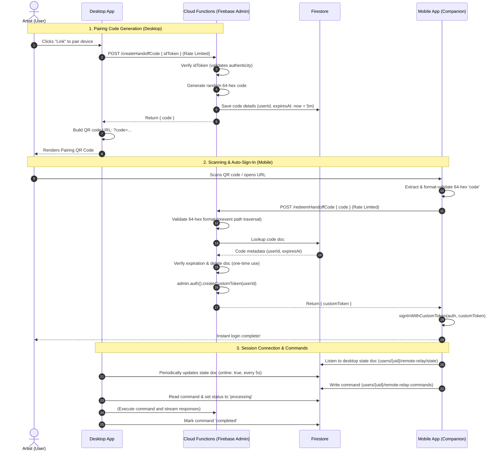

# Mobile Remote Pairing & Handoff Authentication Architecture

This flowchart illustrates the end-to-end flow for secure pairing of the mobile remote companion device with the desktop app, including the passwordless custom token handoff and the secure exponential backoff persistence mechanism.

### Key Security & Reliability Measures
1. **Endpoint Rate Limiting**: Both `/createHandoffCode` and `/redeemHandoffCode` implement a transaction-locked rate limiter in Cloud Functions (max 10 requests/minute per client IP) to block brute-force attempts.
2. **Format Sanitization**: Handoff code parameter is validated to match a strict 64-character hexadecimal regex (`/^[a-fA-F0-9]{64}$/`) server-side to prevent malicious directory traversal or injections.
3. **Reactive Auth Check**: The mobile remote subscribes to Firebase auth state changes via `onAuthStateChanged` and transitions from `idle` to `pairing` state as soon as credentials resolve, preventing race conditions or permanent loading spinners on cold loads.
4. **Heartbeat Presence**: The desktop's online presence threshold (`DESKTOP_HEARTBEAT_STALE_MS`) is configured to 15 seconds to ensure quick detection of desktop app crashes or sudden network drops.
5. **Robust Storage Sync**: Critical state writes (`persistQueueToFirestore` and `saveProfileToStorage`) utilize a recursive exponential backoff retry loop (up to 3 attempts) to survive transient cloud database synchronization failures.

## Step-by-Step Transition Breakdown

1. **Link Request Initiated (Steps 1-17)**: The artist clicks the "Link" pairing option in the Desktop App to connect a new companion device. The Desktop App requests a short-lived pairing code by POSTing the user's Firebase Auth ID token to the `/createHandoffCode` endpoint.
2. **Short-lived Handoff Code Generation (Steps 18-21)**: The Cloud Function verifies the token, generates a unique, cryptographically random 64-character hexadecimal code, stores it in Firestore under the `auth_handoffs` collection with a 5-minute TTL, and returns the code to the Desktop App.
3. **QR Rendering (Steps 22-23)**: The Desktop App generates a companion QR code containing the pairing URL embedded with the 64-character hex code parameter and renders it on screen.
4. **Mobile Handoff Scan (Steps 27-28)**: The artist scans the QR code using their mobile device. The Mobile App extracts the `code` query parameter from the scanned URL and runs a strict client-side format validation to check for a 64-hexadecimal format.
5. **Custom Token Redemption (Steps 29-35)**: The Mobile App submits the code to the `/redeemHandoffCode` Cloud Function. The endpoint sanitizes the input, performs a transaction-locked rate limit lookup, validates the code against Firestore, deletes the single-use handoff document, generates a Firebase Custom Auth Token using the admin SDK, and returns it to the Mobile App.
6. **Passwordless Auto-Authentication (Steps 36-38)**: The Mobile App invokes `signInWithCustomToken` to securely authenticate the artist on the companion device, completing sign-in and replacing the browser history to remove the short-lived code from the URL.
7. **Heartbeat Session Setup (Steps 41-42)**: Once authenticated, the Mobile App starts listening to the user's desktop state document in Firestore (`users/{uid}/remote-relay/state`), while the Desktop App periodically updates the document every 5 seconds (heartbeat) to broadcast its online presence.
8. **Command Flow Coordination (Steps 43-47)**: The Mobile App writes remote control commands to the command queue document. The Desktop App's `useRemoteCommandListener` detects the new command, flags it as `processing`, executes the associated action in the Studio, and updates the status to `completed` upon completion, keeping the companion updated in real-time.
