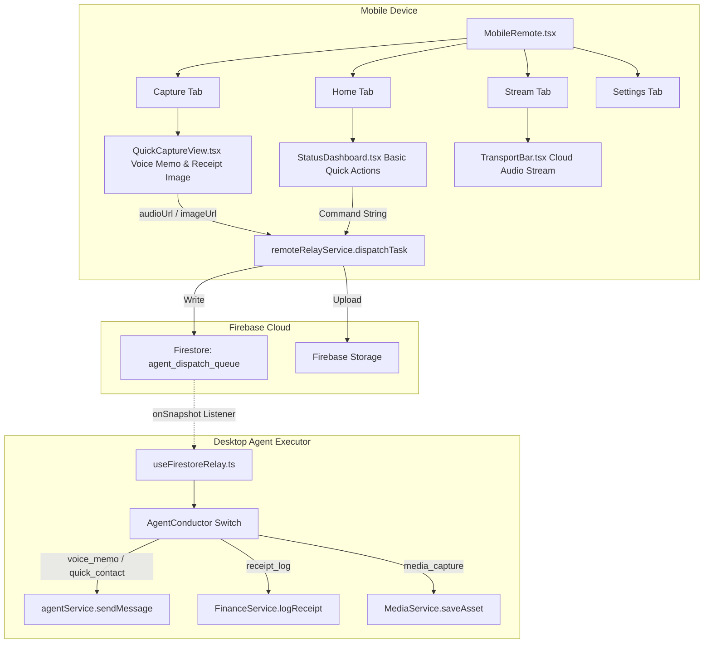

# Mobile Remote UI Architecture

This flowchart describes the new, simplified "Basic & Void-Styled" Mobile Remote UI, focusing on the high-level routing, data flow, and Cloud Relay synchronization.

## Step-by-Step Transition Breakdown
1. Mobile capture generates blob in memory and securely uploads directly to Firebase Storage.
2. The download URL is dispatched through Firestore Queue.
3. The desktop background listener intercepts the Firestore change and delegates to the AgentConductor.

## Description
This architecture completely decouples the complex multi-metric system and focuses strictly on high-leverage mobile actions: quick notes (voice) and rapid tracking (receipt photos). The data is dispatched to the `agent_dispatch_queue` via Firestore, where the Desktop Executor (which is always running in the background) picks up the tasks and routes them through the AI agents. The response is synced back, creating a resilient Cloud Relay link that does not depend on immediate local network availability.
