# Monorepo CI/CD Pipeline Flowchart

This flowchart maps the **GitHub Actions deployment pipeline** for **indii** — a sharded, parallel monorepo CI flow with gated production deployment, Firebase Hosting multi-target promotion, and real-time e2e validation.

```mermaid
graph TD
    %% Trigger
    subgraph Trigger ["Trigger Events"]
        Push["Push to main"]
        Manual["Manual Dispatch (workflow_dispatch)"]
    end

    %% Concurrency
    subgraph Concurrency ["Concurrency Control"]
        Group["Group: workflow-main"]
        Cancel["Cancel in-progress if new push"]
    end

    %% Setup Job
    subgraph Setup ["Setup Job (ubuntu-latest)"]
        Checkout1["Checkout (fetch-depth: 1)"]
        NodeSetup1["Setup Node 22.x"]
        CacheCheck["Check node_modules cache"]
        Install["npm install (if cache miss)"]
        Sanity["Sanity Checks (appSlice, Electron mocks)"]
    end

    %% Unit Tests (Sharded)
    subgraph UnitTests ["Unit Tests (Sharded 4x Matrix)"]
        Shard1["Shard 1/4"]
        Shard2["Shard 2/4"]
        Shard3["Shard 3/4"]
        Shard4["Shard 4/4"]
    end

    %% Build Job
    subgraph Build ["Build Job (needs: unit-tests)"]
        Checkout2["Checkout (fetch-depth: 0)"]
        NodeSetup2["Setup Node 22.x"]
        Lint["ESLint checks"]
        TypeCheck["TypeScript type check"]
        Audit["npm audit (non-blocking)"]
        BuildLanding["Build landing page"]
        BuildStudio["Build studio app (with App Check token)"]
        LandingUpload["Upload landing artifact"]
        StudioUpload["Upload studio artifact"]
    end

    %% Deploy Staging
    subgraph DeployStaging ["Deploy to Staging (needs: build)"]
        StageCheckout["Checkout"]
        StageDeploy["firebase deploy (staging target)"]
        StageURL["Staging URL live"]
    end

    %% E2E Smoke Tests
    subgraph E2EStaging ["E2E Tests (needs: deploy-staging)"]
        E2ESetup["Setup Playwright"]
        E2EEnv["Set VITE_FIREBASE_E2E_MOCK=true"]
        E2EApp["Load staging app"]
        E2ETests["Run smoke tests (Dashboard, Workspace, CommandBar)"]
        E2EPass["Pass/Fail result"]
    end

    %% Production Gate
    subgraph Gate ["Production Gate (Conditional)"]
        Condition["if: build SUCCESS && e2e SUCCESS"]
        GatePass["✓ Production approved"]
        GateBlock["✗ Blocked (e2e failure)"]
    end

    %% Deploy Production
    subgraph DeployProd ["Deploy to Production (needs: deploy-staging, e2e-staging)"]
        ProdCheckout["Checkout"]
        ProdDeploy["firebase deploy (app target)"]
        ProdURL["Production URL live"]
        Sentry["Upload Sentry source maps"]
    end

    %% External
    subgraph External ["External Services"]
        Firebase["Firebase Hosting (2 targets: landing, app)"]
        Sentry2["Sentry (Error Tracking)"]
    end

    %% Flow
    Push & Manual -->|"Trigger"| Group
    Group --> Cancel
    Cancel --> Checkout1

    Checkout1 --> NodeSetup1
    NodeSetup1 --> CacheCheck
    CacheCheck --> Install
    Install --> Sanity
    Sanity -->|"Gate: must pass"| Shard1 & Shard2 & Shard3 & Shard4

    Shard1 & Shard2 & Shard3 & Shard4 --> Checkout2

    Checkout2 --> NodeSetup2
    NodeSetup2 --> Lint
    Lint --> TypeCheck
    TypeCheck --> Audit
    Audit --> BuildLanding
    BuildLanding --> BuildStudio
    BuildStudio -->|"VITE_FIREBASE_APP_CHECK_DEBUG_TOKEN injected"| LandingUpload
    LandingUpload --> StudioUpload

    StudioUpload --> StageCheckout
    StageCheckout --> StageDeploy
    StageDeploy --> StageURL

    StageURL --> E2ESetup
    E2ESetup --> E2EEnv
    E2EEnv --> E2EApp
    E2EApp --> E2ETests
    E2ETests --> E2EPass

    E2EPass -->|"always()"| Condition
    Condition -->|"both green"| GatePass
    Condition -->|"e2e red"| GateBlock
    GateBlock -->|"Deployment halted"| External

    GatePass --> ProdCheckout
    ProdCheckout --> ProdDeploy
    ProdDeploy --> ProdURL
    ProdURL --> Sentry
    Sentry --> Firebase

    %% Styling
    style Push fill:#00D4FF,color:#000
    style Manual fill:#00D4FF,color:#000

    style Checkout1 fill:#8A2BE2,color:#FFF
    style Checkout2 fill:#8A2BE2,color:#FFF
    style Install fill:#FF00FF,color:#FFF

    style Shard1 fill:#39FF14,color:#000
    style Shard2 fill:#39FF14,color:#000
    style Shard3 fill:#39FF14,color:#000
    style Shard4 fill:#39FF14,color:#000

    style Lint fill:#FF8C00,color:#000
    style TypeCheck fill:#FF8C00,color:#000
    style BuildLanding fill:#FF8C00,color:#000
    style BuildStudio fill:#FF8C00,color:#000

    style StageDeploy fill:#FF00FF,color:#FFF
    style StageURL fill:#00D4FF,color:#000

    style E2ESetup fill:#FF00FF,color:#FFF
    style E2ETests fill:#FF00FF,color:#FFF
    style E2EPass fill:#00D4FF,color:#000

    style Condition fill:#FF00FF,color:#FFF
    style GatePass fill:#39FF14,color:#000
    style GateBlock fill:#FF3333,color:#FFF

    style ProdDeploy fill:#FF00FF,color:#FFF
    style ProdURL fill:#00D4FF,color:#000
```

## Transition Breakdown

1. **Trigger:** A push to `main` or manual workflow_dispatch triggers the pipeline. The concurrency group ensures only one deploy workflow runs at a time — any new push cancels the in-progress job (`cancel-in-progress: true`).

2. **Setup Job:** Checks out code, installs Node 22.x, restores cached node_modules (keyed on `package-lock.json`), and runs sanity checks (duplicate identifiers in appSlice, Electron test mocks).

3. **Unit Tests (Sharded 4x):** The test matrix splits across 4 parallel jobs, each running 25% of tests. All 4 must pass before proceeding to build. This cuts test time from ~10min to ~3min.

4. **Build Job:** Runs linting, TypeScript type-check, and npm audit (non-blocking). Builds both the landing page and the studio app with all environment variables, including the **App Check debug token** (required so the deployed staging app can pass App Check from headless CI).

5. **Deploy to Staging:** Deploys the studio artifact to the `staging` Firebase Hosting target. The staging URL becomes live and accessible to e2e tests.

6. **E2E Smoke Tests:** Loads the deployed staging app and runs Playwright smoke tests against real UI (Dashboard, Agent Workspace, CommandBar). The key setup: `VITE_FIREBASE_E2E_MOCK=true` is NOT injected (staging is a PROD build), so tests hit real Firebase. Tests verify the app initializes, the buttons render, and basic flows work.

7. **Production Gate (Conditional):** The `deploy-production` job has a conditional: `if: always() && needs.deploy-staging.result == 'success' && needs.e2e-staging.result == 'success'`. This gate was broken before (e2e had `continue-on-error: true`), allowing bad builds to ship. Now the gate is real — failing e2e blocks production.

8. **Deploy to Production:** Only runs if BOTH staging deploy and e2e tests passed. Deploys the studio artifact to the `app` Firebase Hosting target (production). Uploads Sentry source maps for error tracking.

9. **External Handoff:** Firebase Hosting serves both the landing page (`landing` target) and the production Studio app (`app` target). Sentry begins tracking errors in real-world usage.

## Performance Optimizations

| Optimization | Impact |
|---|---|
| **Sharded unit tests (4x matrix)** | ~7min → ~3min per run |
| **Node modules caching** | Skip npm install on cache hit |
| **Shallow clones (fetch-depth: 1)** | Faster checkout |
| **Concurrency + cancel-in-progress** | Stop stale jobs if new push lands |
| **Non-blocking audit** | Don't fail deploy on npm audit warnings |

## Critical Gate Fix (Recent)

**Before:** e2e-staging had `continue-on-error: true`, so failing tests set result='success'. The production gate `needs.e2e-staging.result == 'success'` inadvertently passed, allowing broken builds to reach production.

**After:** Removed `continue-on-error` from e2e-staging. Now a real test failure sets result='failure', and the gate correctly blocks bad deployments.

## Environment Variables (Build Step)

The `build-studio` step injects all Firebase config:
- `VITE_FIREBASE_API_KEY` (identifier, safe)
- `VITE_FIREBASE_APP_CHECK_KEY` (reCAPTCHA site key, from GitHub secret)
- `VITE_FIREBASE_APP_CHECK_DEBUG_TOKEN` (CI debug token, from GitHub secret — allows headless e2e to pass App Check)
- All other Firebase project IDs, storage buckets, etc.
