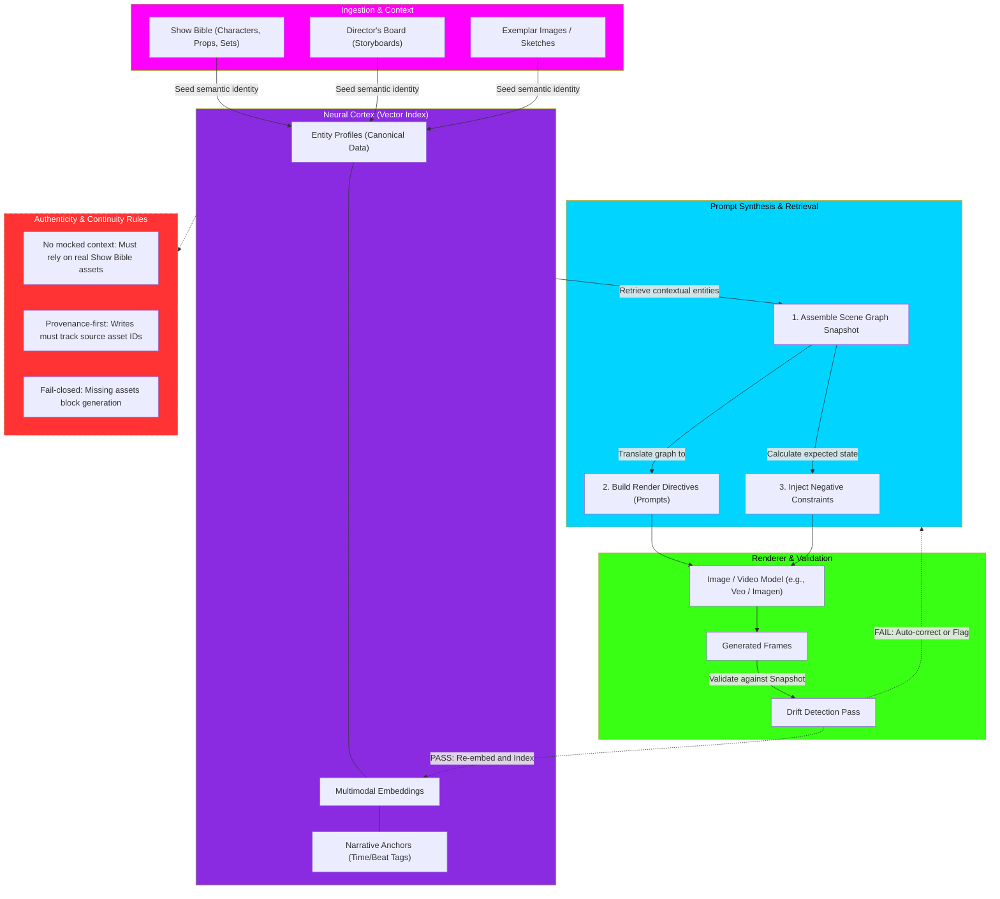

# Neural Cortex: Semantic Visual Memory Core Flowchart

This flowchart maps the `Neural Cortex`, a vector-based imagination system that ensures visual continuity (wardrobe, lighting, character traits) across long video/story sequences. It prevents visual "drift" by anchoring generated assets to canonical Show Bible entities rather than just referencing prior pixel outputs.

## Transition Breakdown

1. **Ingest & Contextualization:** Canonical data (like the Show Bible descriptions and approved character sketches) are ingested into the Cortex. This creates immutable `Entity Profiles` and seeds the multimodal vector `Embeddings`. These are tagged with `Narrative Anchors` (e.g., "Post-battle damage, Episode 3").
2. **Snapshot Assembly:** When a new shot is planned, the Cortex retrieves the specific embeddings for that narrative beat. It builds a `Scene Graph Snapshot` tracking who is in the scene, where they are, and what emotional tone or lighting is required.
3. **Synthesis:** The snapshot is translated into explicit `Render Directives` (prompts) and negative constraints. This ensures the rendering engine knows exactly what the character must look like in this exact point in time.
4. **Generation & Drift Check:** The model generates the frame. Before accepting it, a `Drift Detection Pass` compares the output back against the expected Scene Graph Snapshot. If the frame "drifted" (e.g., wrong jacket color, missing prop), it is rejected for automatic inpainting/correction or flagged for human review.
5. **Re-Indexing:** Only validated, approved frames are re-embedded back into the Cortex, ensuring that the system's memory stays perfectly aligned with the approved story timeline.
