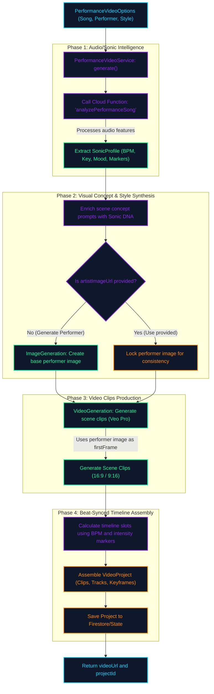

# Performance Video Generation Flowchart

This flowchart maps the multi-step orchestration pipeline implemented in the `PerformanceVideoService` (`PerformanceVideoService.ts`). It outlines how song audio analysis, visual concept generation, keyframe performer imagery, and beat-aligned timeline assembly coordinate to produce finished, synchronized music videos.

---

## The Flowchart Diagram

---

## Detailed Step-by-Step Transition Breakdown

1. **Intake and Options Mapping:**
   - The orchestration begins by invoking `PerformanceVideoService.generate(options)`. The options payload contains the `songUrl` (required), along with optional configuration like `artistImageUrl`, `artistDescription` (performer prompt), `style` preset, `aspectRatio`, and target `sceneCount`.

2. **Sonic Intelligence Analysis:**
   - The service invokes a backend Firebase Cloud Function (`analyzePerformanceSong`) using `httpsCallable`.
   - This function runs local-first audio analysis to extract the song's **SonicProfile**, which includes the exact tempo (BPM), musical key, dominant mood, acoustic textures, intensity profile (0.0 to 1.0), and timestamp markers mapping to beat patterns and dynamic shifts.

3. **Visual Concept & Performer Synthesis:**
   - The service enriches scene concepts based on the extracted mood, genre, and intensity.
   - **Performer Reference Lock:** To ensure character consistency across the video, a base image of the performer is required:
     - If the user provided a reference image (`artistImageUrl`), it is locked as the visual anchor.
     - If only a description was provided, the service calls `ImageGeneration` to generate a high-quality base portrait matching the style description.

4. **Widescreen/Portrait Clip Generation:**
   - The service creates multiple video scenes (matching the requested `sceneCount`).
   - For each scene, the base performer image is passed as `firstFrame` to the `VideoGeneration` engine (Veo 3.1 Pro) along with the beat-enriched scene prompt. This ensures consistent performer likeness throughout the generated clips.

5. **Timeline Synchronization and Project Serialization:**
   - Using the song's BPM and intensity peaks, the service maps each generated video clip to a precise track slot on the video timeline. High-intensity clips are mapped to dynamic drops, and clip lengths are adjusted to align with musical subdivisions.
   - The resulting `VideoProject` (containing tracks, clip bounds, and synchronized keyframes) is serialized and persisted to the user's project collection in Firestore.

6. **Output Delivery:**
   - The service returns the primary preview `videoUrl` and the created `projectId` to the caller, allowing the UI to load the complete workspace directly in the Video Editor.
