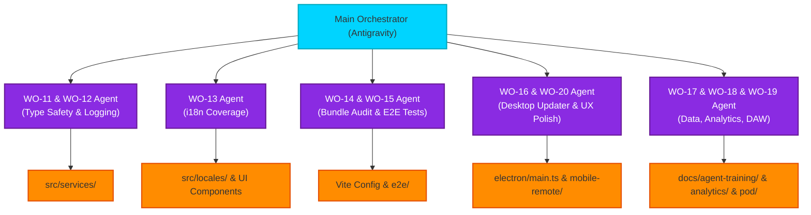

# Phase 2 Work Orders Execution Flowchart

This flowchart outlines the parallel execution strategy for Phase 2 Work Orders (WO-11 to WO-20) using an Agentic Swarm approach.

### Transition Breakdown

1. **Main Orchestrator (Antigravity):** Reads the overarching `PRODUCTION_WORK_ORDER_PHASE2.md` and divides the 10 work orders into logical groups.
2. **Specialized Agents Triggered:** Subagents are spawned via the A2A Swarm Protocol to tackle distinct functional areas simultaneously:
   - **Agent 1:** Focuses on service-layer hygiene (WO-11: `any` casts, WO-12: Structured Logger).
   - **Agent 2:** Focuses on frontend user strings (WO-13: i18n).
   - **Agent 3:** Focuses on performance and QA (WO-14: Bundle Size, WO-15: E2E Tests).
   - **Agent 4:** Focuses on app shell and mobile remote (WO-16: Electron Auto-Update, WO-20: indiiREMOTE UX).
   - **Agent 5:** Focuses on backend data processing and integration (WO-17: Training Data, WO-18: Analytics, WO-19: DAW Onramp).
3. **Execution & Validation:** Each agent performs its task, runs relevant tests (e.g., `npm run lint`, `npm test`), and reports back to the Main Orchestrator.
4. **Consolidation:** The Main Orchestrator reviews the diffs and commits the changes.
