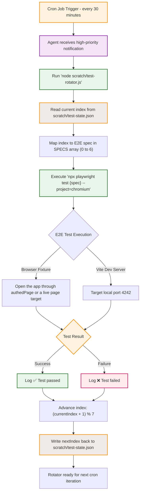

# Project Pinocchio Media Test Rotator Flowchart

Purpose: Map the execution, state transition, and feedback loops of the media-focused E2E test rotator cron.

## Transition Breakdown

1. **Trigger Interval**: The background cron scheduler triggers every 30 minutes, outputting a high-priority system message containing instructions to run the rotator script.
2. **State Retrieval**: `scratch/test-rotator.js` initializes and reads `scratch/test-state.json`. If the file is missing or corrupt, it defaults to index `0`.
3. **Spec Selection**: The script maps the index to one of 7 media/boardroom-focused E2E tests:
   - `0: e2e/mega-stress-test-v4.spec.ts`
   - `1: e2e/mega-stress-test-v11.spec.ts`
   - `2: e2e/mega-stress-test-v12.spec.ts`
   - `3: e2e/navigation.spec.ts`
   - `4: e2e/mobile-remote.spec.ts`
   - `5: e2e/visual-qa.spec.ts`
   - `6: e2e/stress-test-new-user.spec.ts`
4. **Isolated Test Execution**: The selected E2E spec runs under Playwright on the `chromium` project, targeting `http://localhost:4242`.
5. **State Progression**: Regardless of whether the test passes or fails, the index is incremented (`currentIndex + 1`) and wrapped around the length of the array (`% 7`), then saved to `scratch/test-state.json` to prevent execution loops from getting stuck on a single failing spec.
