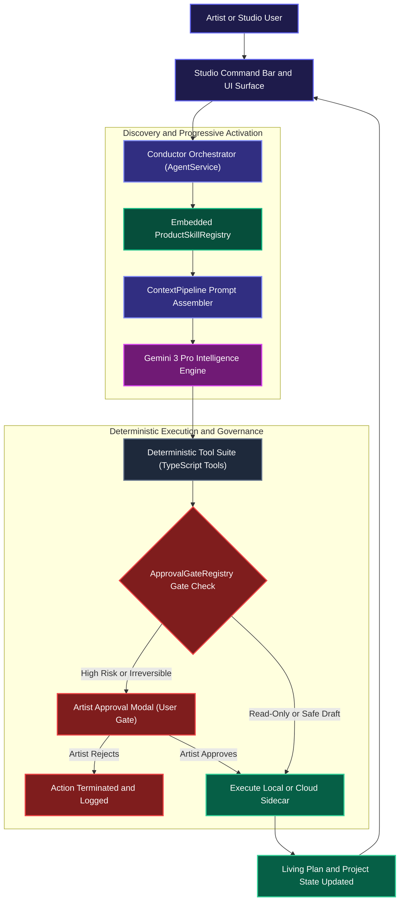

# Product Skill Runtime Architecture

Evidence-based visualization of how an embedded Product Skill executes inside the shipped indii.music desktop and web studio.

## Purpose

This architecture diagram traces the end-to-end lifecycle of a Product Skill: from an artist's natural language request or studio action, through intent matching, embedded progressive disclosure, prompt assembly, deterministic tool invocation, governance gates, and final state reconciliation.

## Step-by-Step Transition Breakdown

### Phase 1: Artist Request & Intent Dispatch
1. **User Action:** The artist types a request into the studio Command Bar or triggers a studio workflow button (e.g., "Prepare master for Spotify release").
2. **Surface Intake:** The Studio UI captures the input, sanitizes attachments, and hands the message to `AgentService.ts`.
3. **Orchestrator Routing:** The Conductor classifies the user's intent across 23 specialist domains (e.g., Music Director, Distribution Chief, Publishing Administrator).

### Phase 2: Embedded Discovery & Progressive Disclosure
4. **Registry Lookup:** The Conductor consults `ProductSkillRegistry`, an in-memory compile-time registry embedded directly inside the app bundle. It identifies the target skill (e.g., `audio_engineering` or `digital_distribution`).
5. **Context Splicing:** Rather than stuffing all 27 playbooks into the prompt, `ContextPipeline.ts` retrieves only the active `SKILL.md` playbook and injects it into the prompt's `<active_product_skill>` section.
6. **Reasoning & Protocol Adherence:** Gemini 3 Pro receives the exact industry standard operating procedure (e.g., -14 LUFS loudness ceiling, -1.0 dB True Peak, 3000x3000px RGB cover art).

### Phase 3: Deterministic Execution & Safety Gates
7. **Tool Invocation:** The model emits a structured tool call into `TOOL_REGISTRY` (e.g., `scan_master`, `compile_release_harness`, or `register_work`).
8. **Risk Tier Evaluation:** `ApprovalGateRegistry.ts` evaluates the action's risk level (`read`, `draft`, `approval_required`, or `destructive`).
9. **Artist Approval Gate:**
   - **Safe/Read Actions:** (e.g., audio frequency analysis, metadata QC) execute immediately.
   - **Irreversible Actions:** (e.g., paying out royalties, submitting DDEX packages, signing split contracts, spending ad budgets) halt execution and prompt the artist for explicit confirmation via `ConfirmDialog.call()`.
10. **Sidecar/Engine Execution:** Upon approval, the deterministic TypeScript/Python execution layer completes the task (e.g., ffprobe analysis, DDEX XML compilation, Stripe/Printful checkout).

### Phase 4: Truthful State Reconciliation
11. **Persistence & Plan Update:** The outcome is written to the project's Living Plan, Firestore state, or local vault.
12. **Artist Feedback:** The UI renders the verified result with exact metrics, confidence scores, and run IDs—with zero simulated or hallucinated numbers.
