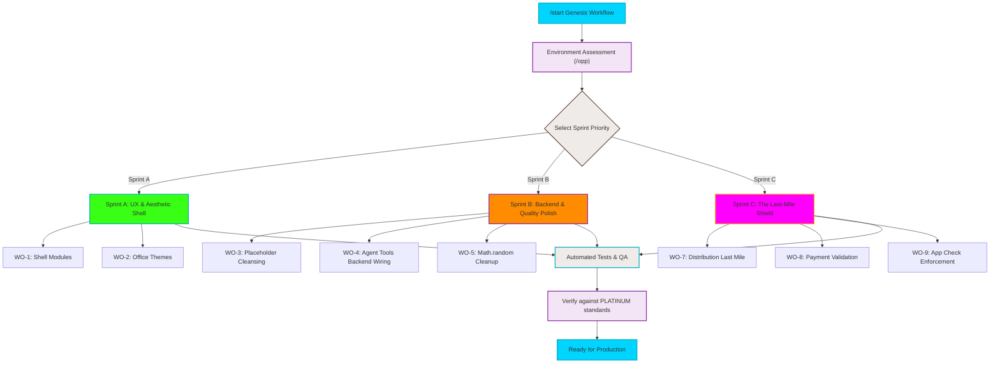

# Production Work Order Sprints Flowchart

This flowchart visualizes the sequence of Sprints proposed in the implementation plan to tackle the active work orders from Phase 1 and Phase 2.

## Transition Breakdown

1. **Initialization:** The `/start` workflow assesses the current git status, error ledger, and handoff state via `/opp`.
2. **Decision Gate:** The user determines the primary area of focus: UX (Sprint A), Backend Integration (Sprint B), or Security/Validation (Sprint C).
3. **Sprint A (UX & Aesthetics):** Expands the 7 missing shell modules and implements the 17 unique "Office Space" themes.
4. **Sprint B (Backend Polish):** Replaces all user-facing placeholders, wires the prompt-only Agent Tools (Publishing, Licensing, Social, Brand) to Firestore, and removes unsecure Math.random usages.
5. **Sprint C (Last-Mile Shield):** Hardens the application by finalizing distribution adapters, verifying Stripe Test Mode limits, and enforcing App Check.
6. **Testing & QA:** All executed sprints undergo rigorous CI validation (`npm test`) and type-checking to maintain the 100% green status.
7. **Production Seal:** Once the chosen sprint is complete and verified against the Platinum Quality Standards, the feature is ready to ship.
