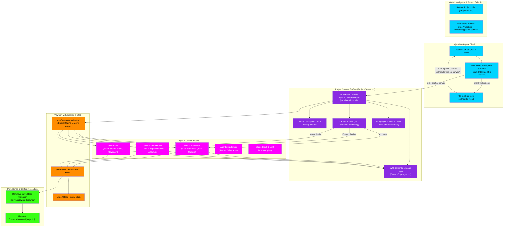

# Project Canvas & Dual-Mode Workspace Architecture Flowchart

This flowchart documents the architecture and lifecycle of the **Project Canvas** within indii. Following the navigation realignment, Project Canvas is elevated to the primary landing view when selecting any project from the `PROJECTS` list. It models the dual-mode workspace switcher (`[ Spatial Canvas | File Explorer ]`), native block types (`NoteBlock`, `WorkflowBlock`, `AssetBlock`), SVG semantic edge rendering, spatial viewport virtualization, and defensive persistence.

## Step-by-Step Transition Breakdown

1. **Primary Project Selection & Landing:** When a user selects any project in `Sidebar.tsx` (`ProjectList.tsx`), the client executes `syncProject(project.id)` to load project metadata and immediately dispatches `setModule('project-canvas')`. Unlike legacy routing, the spatial **Project Canvas** is the primary, zero-latency landing view for active projects.
2. **Dual-Mode Workspace Switcher:** The top-left header of the canvas anchors a persistent workspace switcher: `[ Spatial Canvas | File Explorer ]`. Clicking "File Explorer" transitions the view seamlessly to `setModule('files')` for traditional directory browsing, while clicking "Spatial Canvas" returns directly to the infinite visual board with zoom and pan positions preserved.
3. **Hardware-Accelerated Spatial Rendering:** The canvas utilizes a hardware-accelerated DOM coordinate surface (`translate3d` + CSS `transform: scale`) rather than an opaque canvas bitmap, allowing full DOM interactivity, native text selection, and accessible rich-text controls.
4. **Native Spatial Blocks:**
   - **`NoteBlock`:** Direct on-canvas note capture and markdown documentation, completely replacing the retired Tools-menu Notes interface. Notes can be placed anywhere on the infinite plane and visually connected to assets.
   - **`WorkflowBlock` & `WorkflowRunBlock`:** Live automation blocks referencing recipes created in the elevated Swarm Intelligence Workflow Builder, allowing users to trigger runs and observe step progress directly in context.
   - **`AssetBlock` & `AgentOutputBlock`:** Master WAV stems, artwork drafts, and deliverables produced by specialist agents (e.g. Legal contracts, Marketing plans) with thumbnail previews and playback controls.
5. **Semantic Edge Connections:** An SVG layer (`CanvasEdgeLayer.tsx`) renders non-executing directional lineage curves between blocks, mapping artistic relationships (e.g., Audio Stem → Pre-Flight QC Note → Cover Art Draft) without cluttering block DOM hierarchies.
6. **Viewport Virtualization & LOD:** The `useCanvasVirtualization` engine computes block bounding boxes against the container viewport plus a 400px culling margin. Blocks outside the viewport are culled from the DOM; at extreme zoom-out levels, clusters collapse into lightweight `ClusterBlock` badges to sustain 60fps performance across thousands of project artifacts.
7. **Defensive Persistence & Anti-Race Guards:** All block movements, additions, and edits pass through `useProjectCanvas` into `ProjectCanvasPersistence.ts`. A debounced defensive save pipeline ensures that concurrent edits, rapid drag events, and network jitter never cause save-race overwrites or cross-project data leakage.
