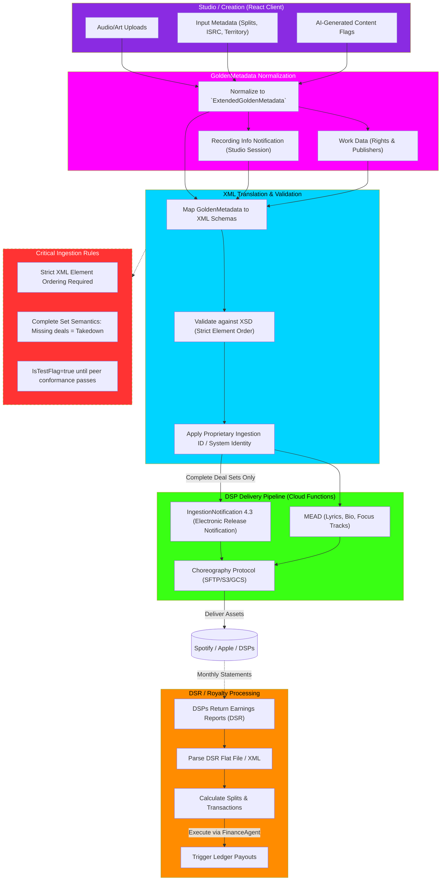

# Proprietary Ingestion Pipeline Flowchart

This flowchart maps the `Proprietary Ingestion IP Implementation`, detailing the complete life cycle of an asset from studio creation, through GoldenMetadata normalization, schema validation, DSP delivery, and finally to automated royalty processing (Earnings Report/DSR).

## Transition Breakdown

1. **Studio / Creation:** The user uploads raw audio and cover art while inputting crucial metadata (splits, ISRCs, AI-generation flags, territory locks) within the `MetadataDrawer`.
2. **Core Processing:** The frontend normalizes this raw input into the rigid `ExtendedGoldenMetadata` schema. Simultaneously, it generates a `Recording Info` notification (documenting studio sessions, engineers, equipment) and `Work Data` (publishing rights and claims).
3. **XML Translation & Validation:** The backend parser maps the `GoldenMetadata` to strict proprietary XML schemas (like ERN-4.3.xsd). It enforces strict XSD validation, ensuring no comma-separated arrays exist and that elements are perfectly ordered. The `Proprietary Ingestion ID` is attached to authorize the payload.
4. **Delivery Pipeline:** The validated XML is split into an `IngestionNotification` (Release notification) and `MEAD` (Media Enrichment, like lyrics). The `Choreography Protocol` securely packages and uploads the XML and media files to DSPs via SFTP/S3/GCS. *Crucial Rule:* It uses "Complete Set Semantics" where omitting a territory implies a takedown.
5. **DSR / Royalty Processing:** Months later, DSPs return Digital Sales Reporting (DSR) flat files. The pipeline parses these reports, calculates exact contributor splits based on the original `GoldenMetadata`, and triggers the `FinanceAgent` to disburse payouts via the `CostControlService` ledger.
