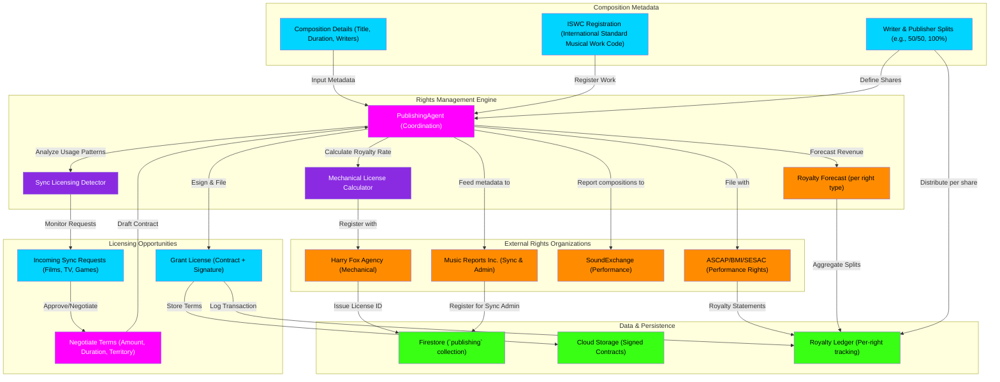

# Publishing Rights & Licensing Flowchart

This flowchart maps the publishing rights module—where artists manage mechanical licenses, sync licensing, and publishing administration. It details how indii coordinates with mechanical rights organizations (Harry Fox, MRI) and sync distributors.

## Transition Breakdown

1. **Composition Metadata:** Artist enters composition details—title, duration, writer names, splits (e.g., 100% writer = artist, or split with co-writers). The **Publishing Agent** reads this input.

2. **ISWC Registration:** The composition is registered with an **ISWC code** (International Standard Musical Work Code), a unique identifier for the work globally.

3. **Mechanical Licensing:** The **Mechanical License Calculator** computes the **statutory mechanical royalty rate** (e.g., $0.091 per track). This is registered with **Harry Fox Agency**, which issues a **License ID** and stores terms in Firestore.

4. **Sync Opportunities:** The **Sync Opportunity Detector** monitors for incoming **Sync Requests** (e.g., a film producer wants to use the track). The **Publishing Agent** reviews, negotiates terms (amount, duration, territory), and either approves or counter-offers.

5. **License Execution:** Once agreed, the **Publishing Agent** drafts a **License Contract**, both parties e-sign, and the contract is filed in **Cloud Storage**. The transaction is logged to the **Royalty Ledger**.

6. **Multi-Organization Registration:** The agent **feeds composition metadata to Music Reports Inc. (MRI)** for **sync administration** (tracking usage across TV, film, games). It also reports to **SoundExchange** (audio performance) and **ASCAP/BMI/SESAC** (broadcast performance).

7. **Royalty Aggregation:** Quarterly, **Royalty Statements** arrive from performing rights organizations. The **Publishing Agent** aggregates all income streams (mechanical, sync, performance) and distributes per **Writer Splits** to collaborators.

8. **Forecast:** The **Royalty Forecast** projects future income across all license types, helping the artist make financial decisions.

