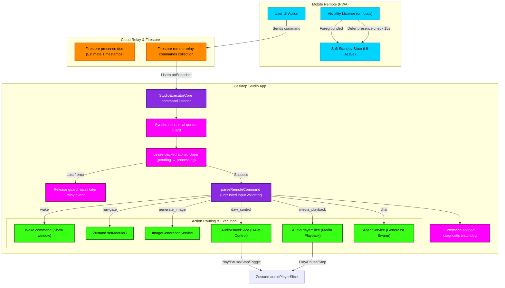

# Remote Connection & Presence Relay Flowchart

This flowchart documents the architecture of the `indiiCONTROLLER` (Mobile PWA remote) presence detection, resilient pairing, and lease-backed desktop command execution system. The retired LAN WebSocket/P2P path is not part of the production architecture.

---

## Mermaid Diagram

---

## Detailed Transitions & Lifecycle

1. **Visibility Focus Delay:**
   When the mobile remote app loses focus (phone lock / background tab), browser timers are aggressively throttled. Upon regaining visibility, `VisibilityListener` instantly clears any pending heartbeat timeout, schedules a deferred connection check in 15 seconds, and prevents aggressive UI offline blocker lockouts.
   
2. **One cloud relay path:**
   Commands travel through the owner-scoped Firestore relay. Every command ID uses the same server lease claim; there is no local WebSocket transport or synthetic-ID bypass.

3. **Atomic Transaction Claim:**
   The desktop listener queries pending commands from Firestore. To prevent multiple desktop instances or delayed processes from double-executing the same command, the lease callable atomically transitions the command status from `pending` to `processing`. The local guard is acquired before awaiting that claim and released on every exit.

4. **Structured Parse and Allowlist validation:**
   Untrusted text from the phone is parsed by `parseRemoteCommand`. It validates parameters against an allowlist (e.g. navigation targets must be valid `ModuleId`s). Invalid commands return `rejected` and are safely completed with an error message without hitting internal engines.

5. **Direct DAW & Media Transport Routing:**
   `DAW_CONTROL` and `MEDIA_PLAYBACK` actions bypass the heavy Generalist Agent pipeline entirely. They route straight to the Zustand `audioPlayerSlice` store, triggering fast, deterministic audio track control (Play, Pause, Stop, Toggle) on the desktop.

6. **Command-scoped watchdog:**
   The watchdog records prolonged execution but never releases the queue while the route promise is unresolved. Its timer is cancelled when that exact command settles, so an older timer cannot unlock a newer command.
