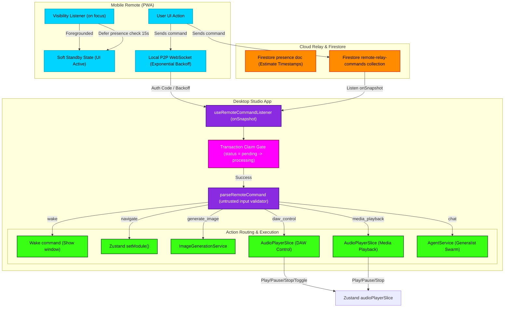

# Remote Connection & Presence Relay Flowchart

This flowchart documents the architecture of the `indiiCONTROLLER` (Mobile PWA remote) presence detection, resilient pairing, and structured desktop command execution system.

---

## Mermaid Diagram

---

## Detailed Transitions & Lifecycle

1. **Visibility Focus Delay:**
   When the mobile remote app loses focus (phone lock / background tab), browser timers are aggressively throttled. Upon regaining visibility, `VisibilityListener` instantly clears any pending heartbeat timeout, schedules a deferred connection check in 15 seconds, and prevents aggressive UI offline blocker lockouts.
   
2. **Exponential P2P Backoff & Auth:**
   The `LocalWS` connection helper targets localhost or private network subnets. If closed, it backs up progressively (exponentially) to prevent connection storms. If it receives a `4001` close code (authentication failed), it stops retrying to prevent resource starvation.

3. **Atomic Transaction Claim:**
   The desktop `Listener` queries pending commands from Firestore. To prevent multiple desktop instances or delayed processes from double-executing the same command, it wraps the state update in a Firestore `runTransaction` to atomically transition the command status from `pending` to `processing`.

4. **Structured Parse and Allowlist validation:**
   Untrusted text from the phone is parsed by `parseRemoteCommand`. It validates parameters against an allowlist (e.g. navigation targets must be valid `ModuleId`s). Invalid commands return `rejected` and are safely completed with an error message without hitting internal engines.

5. **Direct DAW & Media Transport Routing:**
   `DAW_CONTROL` and `MEDIA_PLAYBACK` actions bypass the heavy Generalist Agent pipeline entirely. They route straight to the Zustand `audioPlayerSlice` store, triggering fast, deterministic audio track control (Play, Pause, Stop, Toggle) on the desktop.
