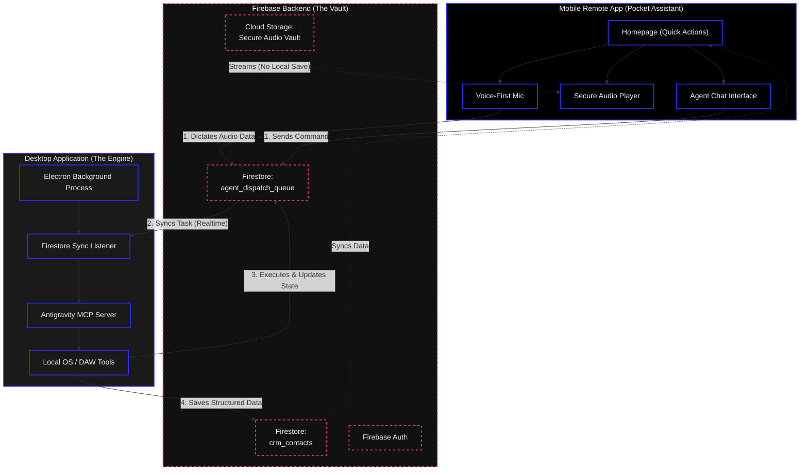

# Remote Dispatch Macro Architecture

This document describes the high-level data flow and architecture of the indii Remote Dispatch system, designed as a "Zero-Local-Data" pocket assistant for artists on the road.

## Architecture Flowchart

## Transition Breakdown

1.  **Zero-Local-Data Mobile:** The phone app stores absolutely no business logic or unreleased tracks locally. If the phone is lost, no data is compromised.
2.  **Voice-First Input:** Users click the microphone, dictate notes or hand the phone to a contact, and the raw audio/text is sent to the `agent_dispatch_queue`.
3.  **Silent Desktop Executor:** The Electron app at home runs silently in the background, listening to the `agent_dispatch_queue`. It picks up the task, uses MCP tools to parse it, executes local OS tools if needed, and writes the structured output back to Firestore.
4.  **Secure Streaming:** The audio player streams works-in-progress directly from Firebase Storage, bypassing local downloads entirely.
