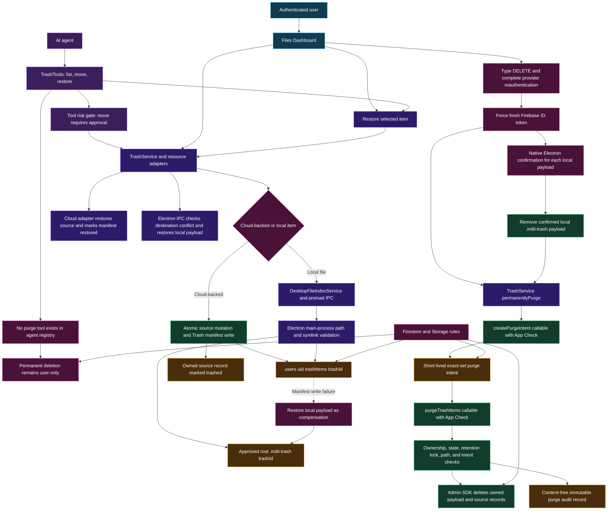

# Reversible Trash System

This diagram defines the user-in-the-loop Trash boundary across agents, the
Studio UI, Firestore and Cloud Storage, and the Electron local-filesystem
executor. Agents may list, move, and restore Trash items; only a freshly
reauthenticated user can initiate permanent deletion.

## Transition Breakdown

1. An agent receives only `list_trash`, `move_to_trash`, and
   `restore_from_trash` from `TrashTools.ts`. `ToolRiskRegistry.ts` classifies
   a move as a reversible write requiring approval, and the registry security
   test rejects permanent-delete tool names and executors.
2. Both the agent tools and `FileDashboard.tsx` call `TrashService.ts`.
   `TrashTargetSchema` validates the resource type and stable target ID before
   a registered adapter inspects ownership, retention state, and restore data.
3. For cloud-backed records, the adapter commits the source's trashed state and
   `users/{uid}/trashItems/{trashId}` manifest in one Firestore batch. The
   manifest records provenance, project context, original location, and restore
   data without granting the browser deletion authority.
4. For local files, `DesktopFileIndexService.ts` sends an approved-folder ID,
   relative path, and Trash ID through preload IPC. `system.ts` rejects path
   traversal and symbolic links, then atomically renames the item into
   `.indii-trash/{trashId}`. If the Firestore manifest write fails,
   `TrashService` restores the local payload as compensation.
5. Restore requests return through the same adapter. Cloud adapters restore the
   owned source and transition the manifest to `restored`; Electron rejects an
   occupied destination before renaming a local payload back into the approved
   root.
6. Permanent deletion starts only in the Files Dashboard. The user types
   `DELETE`, reauthenticates with the account's supported provider, and forces a
   fresh ID token. A local payload additionally requires the unbypassable native
   `dialog.showMessageBox` confirmation in the Electron main process.
7. `TrashService.permanentlyPurge` validates canonical, unique Trash IDs and
   validates both callable responses. `createPurgeIntent` binds a five-minute
   token to that exact item set; `purgeTrashItems` consumes it once and checks
   ownership, Trash state, legal hold, and Storage path scope before using the
   Admin SDK.
8. A successful cloud purge removes the owned payload and source records, then
   writes a content-free `TRASH_PERMANENT_PURGE` audit record. Partial failures
   are returned per Trash ID so the UI reports the exact items that remain.
9. Firestore rules let owners read and schema-create manifests, allow only the
   narrow `trashed` to `restored` update, and deny client deletion of manifests
   and purge intents. Storage rules deny all client writes and deletes under the
   Trash quarantine and deny client deletion from general user storage.

## Runtime Invariants

1. No AI-agent declaration, risk entry, or executable registry entry may expose
   purge, empty-trash, hard-delete, or permanent-delete capability.
2. A Trash move is reversible and ownership-scoped; a retention-locked item is
   rejected before its source changes.
3. Permanent deletion requires user reauthentication, exact typed confirmation,
   App Check on both callables, a single-use exact-set intent, and server-side
   policy checks.
4. Local filesystem access is confined to a user-approved root, excludes
   symlinks and traversal, and never exposes `.indii-trash` in normal asset
   search results.
