# RightsOps Harness Registration Submit Flow

## Purpose

This flowchart maps the complete registration submission workflow through the multi-layer RightsOps harness. It visualizes how user intent ("submit to BMI") is validated, gated, and executed through five distinct enforcement layers: readiness checking, approval gating, freshness validation, browser pause gates, and workflow state enforcement.

---

## Diagram

```mermaid
graph TD
    Start["User clicks 'Submit Registration'"] --> RegistrationForm["RegistrationForm.handleSubmit()"]
    RegistrationForm --> CompileHarness["Step 1: Compile PublishingRightsCompiler"]
    
    CompileHarness --> CheckBlockers{"Blockers exist?<br/>(splits ≠ 100%,<br/>missing IPI, etc.)"}
    CheckBlockers -->|YES| BlockerUI["Display blockers in form,<br/>disable submit button"]
    BlockerUI --> End1["Halt submission"]
    
    CheckBlockers -->|NO| CheckApprovalGates{"Approval gates exist?<br/>(file_registration)"}
    CheckApprovalGates -->|YES| HasApproval{"User approved<br/>via DigitalHandshake?"}
    HasApproval -->|NO| RequestApproval["Request explicit user<br/>approval via Handshake"]
    RequestApproval --> PauseApproval["⏸️ Pause: Awaiting approval"]
    PauseApproval --> UserApprovesOrDenies{"User approves?"}
    UserApprovesOrDenies -->|Deny| End2["Workflow cancelled"]
    UserApprovesOrDenies -->|Approve| ApprovalGranted["Store approval +<br/>passportHash"]
    
    HasApproval -->|YES| ApprovalGranted
    CheckApprovalGates -->|NO| ApprovalGranted
    
    ApprovalGranted --> ComputeHash["Step 2: Compute<br/>Song Passport SHA-256"]
    ComputeHash --> ValidateFreshness{"Approval hash<br/>matches current<br/>Passport?"}
    ValidateFreshness -->|NO| StaleApproval["Approval is STALE<br/>(track changed)"]
    StaleApproval --> InvalidateApproval["Clear approval,<br/>request re-approval"]
    InvalidateApproval --> RequestApproval
    
    ValidateFreshness -->|YES| CertReview["Step 3: Certification<br/>Review Pause"]
    CertReview --> PauseCert["⏸️ User reviews form,<br/>clicks 'I've reviewed'"]
    PauseCert --> UserConfirmsCert{"User confirms?"}
    UserConfirmsCert -->|NO| End3["User cancelled"]
    UserConfirmsCert -->|YES| FinalSubmit["Step 4: Final Submission<br/>Pause"]
    
    FinalSubmit --> PauseFinal["⏸️ User confirms<br/>binding legal action"]
    PauseFinal --> UserConfirmsFinal{"User confirms?"}
    UserConfirmsFinal -->|NO| End4["User cancelled"]
    UserConfirmsFinal -->|YES| CallAdapter["Step 5: Call<br/>adapter.submit()"]
    
    CallAdapter --> ValidateState["Step 6: Verify workflow<br/>state can advance"]
    ValidateState --> CheckFinalBlockers{"Any final<br/>blockers from<br/>HarnessRun?"}
    CheckFinalBlockers -->|YES| FailWorkflow["Workflow state<br/>advances to FAILED"]
    FailWorkflow --> End5["Submission blocked<br/>at gate"]
    
    CheckFinalBlockers -->|NO| AdvanceStep["Advance WorkflowStep<br/>to STEP_COMPLETE"]
    AdvanceStep --> SubmitLegal["Execute registration<br/>to BMI/PRO/other"]
    SubmitLegal --> PersistRecord["Persist OrgRegistrationRecord<br/>with approvalRunId +<br/>approvalPassportHash"]
    PersistRecord --> Success["✅ Registration filed"]
    
    style Start fill:#00D4FF,stroke:#0097A7,stroke-width:3px
    style RegistrationForm fill:#8A2BE2,stroke:#5B009B,stroke-width:2px
    style CompileHarness fill:#39FF14,stroke:#2FA817,stroke-width:2px
    style CheckBlockers fill:#FF00FF,stroke:#C800C8,stroke-width:2px
    style BlockerUI fill:#FF00FF,stroke:#C800C8,stroke-width:2px
    style CheckApprovalGates fill:#FF00FF,stroke:#C800C8,stroke-width:2px
    style RequestApproval fill:#FF00FF,stroke:#C800C8,stroke-width:2px
    style PauseApproval fill:#FFB300,stroke:#FF8C00,stroke-width:2px
    style ApprovalGranted fill:#39FF14,stroke:#2FA817,stroke-width:2px
    style ComputeHash fill:#39FF14,stroke:#2FA817,stroke-width:2px
    style ValidateFreshness fill:#FF00FF,stroke:#C800C8,stroke-width:2px
    style StaleApproval fill:#FF00FF,stroke:#C800C8,stroke-width:2px
    style CertReview fill:#8A2BE2,stroke:#5B009B,stroke-width:2px
    style PauseCert fill:#FFB300,stroke:#FF8C00,stroke-width:2px
    style FinalSubmit fill:#8A2BE2,stroke:#5B009B,stroke-width:2px
    style PauseFinal fill:#FFB300,stroke:#FF8C00,stroke-width:2px
    style CallAdapter fill:#8A2BE2,stroke:#5B009B,stroke-width:2px
    style ValidateState fill:#39FF14,stroke:#2FA817,stroke-width:2px
    style CheckFinalBlockers fill:#FF00FF,stroke:#C800C8,stroke-width:2px
    style AdvanceStep fill:#39FF14,stroke:#2FA817,stroke-width:2px
    style SubmitLegal fill:#00D4FF,stroke:#0097A7,stroke-width:3px
    style PersistRecord fill:#FF8C00,stroke:#FF6F00,stroke-width:2px
    style Success fill:#00FF00,stroke:#00CC00,stroke-width:3px
    style End1 fill:#FF0000,stroke:#CC0000,stroke-width:2px
    style End2 fill:#FF0000,stroke:#CC0000,stroke-width:2px
    style End3 fill:#FF0000,stroke:#CC0000,stroke-width:2px
    style End4 fill:#FF0000,stroke:#CC0000,stroke-width:2px
    style End5 fill:#FF0000,stroke:#CC0000,stroke-width:2px
```



---

## Detailed Transition Breakdown

### Step 1: Readiness Compilation
**File:** `packages/renderer/src/modules/registration/components/RegistrationForm.tsx:handleSubmit()`

The form triggers `compileHarness('publishing_rights', input, ctx)` which invokes `PublishingRightsCompiler.compile()`.

**Output:** `HarnessRun<PublishingRightsOutput>` containing:
- `blockers[]` — Critical failures (splits ≠ 100%, missing IPI/CAE)
- `approvalGates[]` — Gates requiring explicit sign-off
- `findings[]` — Issues that don't block (low severity)
- `recommendations[]` — Actions routed to specific agents

**Decision:** If `blockers.length > 0`, form displays errors inline and disables the submit button. User must fix the data and re-compile.

---

### Step 2: Approval Gate Check
**File:** `packages/renderer/src/services/business-harness/ApprovalGateRegistry.ts` + `packages/renderer/src/services/agent/governance/DigitalHandshake.ts`

For each gate in `run.approvalGates`:
- Check if gate `riskTier === 'blocked'` or `approvalRequired === true`
- Query `DigitalHandshake` for existing approval on the `'file_registration'` gate
- If no approval exists, request one via the Handshake flow (user sees a confirmation dialog)

**Input to Handshake:**
- `gateId: 'file_registration'`
- `reason: 'Copyright and mechanical rights registrations are binding legal actions.'`
- `riskTier: 'approval'`

**Output:** User either approves (creates `approval` record with timestamp) or denies (workflow halts).

---

### Step 3: Approval Freshness Validation
**File:** `packages/renderer/src/modules/registration/services/PassportHashService.ts`

Once approval is granted, the form computes the **Song Passport hash** of legally-material fields:

```typescript
const passport = {
  title: track.title,
  copyrightClaimant: track.copyrightClaimant,
  publisherName: track.publisherName,
  writers: track.writers.map(w => ({
    name: w.name,
    role: w.role,
    percentage: w.percentage,
    ipiNumber: w.ipiNumber,
  })),
  iswc: track.iswc,
}
passportHash = SHA256(JSON.stringify(passport))
```

**Comparison:** If current hash ≠ stored `approvalPassportHash`, the approval is **STALE**. This means:
- User approved data at time T
- User edited splits/claimant/IPI between T and now
- Approval no longer valid for current state

**Action:** If stale, clear the approval and loop back to Step 2 (request re-approval).

---

### Step 4: Browser Pause Gates (Certification & Final Submission)
**File:** `packages/renderer/src/modules/registration/components/RegistrationForm.tsx`

Two **explicit UX pause gates** prevent hasty clicks:

1. **Certification Pause:** Form displays all entered data (splits, writer IPIs, claimant). User must actively click "I've reviewed this form" before proceeding.
2. **Final Submission Pause:** Form displays a warning: "This action is IRREVERSIBLE. Click 'Confirm' to file registration." User must confirm they understand the binding nature.

**Implementation:** State machine with `pausePhase` tracking:
- `pausePhase === 'certification'` → button disabled, user reviews
- `pausePhase === 'final_submit'` → user confirms binding action
- Both pauses can be cancelled; user can go back and edit

---

### Step 5: Adapter Submission
**File:** `packages/renderer/src/modules/registration/adapters/<Adapter>.ts`

Once all gates pass, the form calls `adapter.submit(harness.output)` which:
- For **Desktop (Electron):** Uses Electron IPC to desktop adapter, which automates browser navigation, form filling, and submission
- For **Web (Portal):** Returns a manual step link for the user to click

**Parameters:** Only the **approved HarnessRun output** is passed — no raw form data. The packet is the source of truth.

---

### Step 6: Workflow State Enforcement
**File:** `packages/renderer/src/services/agent/WorkflowStateService.ts`

Before marking the registration step complete, the service checks:

```typescript
await workflowStateService.advanceStep(
  userId,
  executionId,
  'registration_submit_step',
  result,
  blockers // ← optional blocker array
)
```

If `blockers` array is passed with length > 0:
- Step fails instead of completing
- Workflow state transitions to `FAILED`, not `STEP_COMPLETE`
- Subsequent steps remain unexecuted
- User can retry after fixing the blockers

This prevents workflows from silently succeeding when readiness checks fail mid-execution.

---

### Step 7: Persistence & Success
**File:** `packages/renderer/src/modules/registration/adapters/<Adapter>.ts`

Once submission succeeds (BMI accepts the filing):

1. **Persist to Firestore:**
   ```typescript
   OrgRegistrationRecord {
     orgId, trackId, status: 'filed',
     approvalRunId: harness.run.id,
     approvalPassportHash: passport.hash,
     approvalGrantedAt: timestamp,
     ...
   }
   ```

2. **Log to audit trail:** Record who approved, when, and what the Song Passport was at approval time

3. **Display success:** "Registration filed to BMI. PRO tracking ID: [ID]"

---

## Layer Interaction Summary

| Layer | Role | Failure Mode | Recovery |
|-------|------|--------------|----------|
| **Readiness Compiler** | Checks for missing/invalid data | Returns blockers → submission halted | Fix data + recompile |
| **Approval Gate** | Requires explicit sign-off | User denies approval | Retry with confirmation |
| **Freshness Validation** | Detects drift after approval | Approval is stale | Re-approve current state |
| **Browser Pauses** | Prevents careless clicks | User cancels at pause | Retry from that pause point |
| **Workflow State** | Prevents state drift | Final blockers fail the step | Retry after resolving |

---

## Design Rationale

- **Five Layers > One Gate:** Each layer catches a different class of failure (incomplete data, forgotten changes, careless clicks, concurrent state issues, mid-execution drift)
- **Freshness via Hash:** Automatically detects if user edited data after approval, without relying on user memory
- **Browser Pauses:** UX-layer guardrails, not security gates — users can cancel/edit, but they must explicitly confirm binding actions
- **Agents Recommend Only:** The harness is the authority; agents provide analysis and recommendations but cannot override gates
- **Idempotency Locks:** WorkflowStep transitions are guarded by idempotency keys and the blocker array, preventing re-entry bugs

---

## Files Referenced

- `packages/renderer/src/modules/registration/components/RegistrationForm.tsx`
- `packages/renderer/src/services/publishing/PublishingRightsCompiler.ts`
- `packages/renderer/src/modules/registration/services/PassportHashService.ts`
- `packages/renderer/src/services/business-harness/ApprovalGateRegistry.ts`
- `packages/renderer/src/services/agent/governance/DigitalHandshake.ts`
- `packages/renderer/src/services/agent/WorkflowStateService.ts`
- `packages/shared/src/services/business-harness/types.ts`
