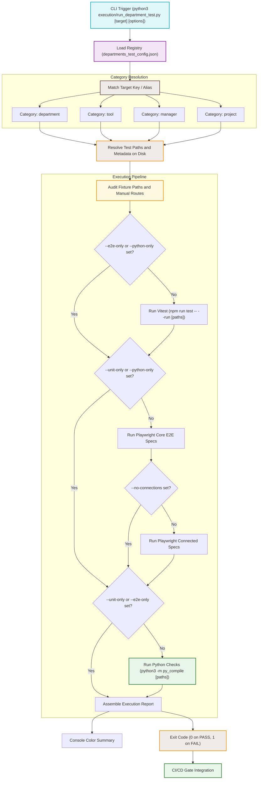

# Scoped Testing Architecture Flowchart

This visual architecture map documents the scoped testing framework, illustrating how category-aware workspace testing (Tools, Departments, Managers, Projects) maps from execution parameters to unit tests, integration E2E tests, Python dependency checks, real fixtures, and manual browser acceptance points.

## Diagram

## Transition Breakdown

1.  **CLI Trigger:** The process begins when a developer or agent runs the CLI command targeting a specific sidebar tab (e.g., `marketing`, `workflow`, `audio-analyzer`).
2.  **Registry Load:** The runner loads the central JSON mapping database (`departments_test_config.json`).
3.  **Category Resolution:** The script resolves the query against keys and aliases, finding the specific category type (e.g., `tool`, `department`, `manager`, `project`).
4.  **Path and Metadata Resolution:** The runner checks the filesystem to filter out non-existent unit/E2E/Python check paths and reports configured fixtures, browser routes, and coverage checklist items.
5.  **Execution Pipeline:** The script runs Vitest for unit/integration tests, Playwright for E2E and connected E2E tests, and Python syntax/dependency surface checks. Options (`--unit-only`, `--e2e-only`, `--python-only`, `--no-connections`) gate each layer.
6.  **Audio System Example:** The `audio-analyzer` target resolves aliases such as `audio`, `mega-test-audio`, and `MegaTestAudioLoop`, then covers Audio Analyzer UI, browser CSP safety, Firebase audio APIs, MusicLibrary persistence, agent audio tools, Distribution/DDEX metadata, main-process file security, Python audio forensic tools, and real WAV/MP3 fixtures.
7.  **Reporting & Exit:** The runner outputs a clear pass/fail summary and exits with the appropriate status code (`0` or `1`) to enforce quality gates in local workflows or CI/CD pipelines.
