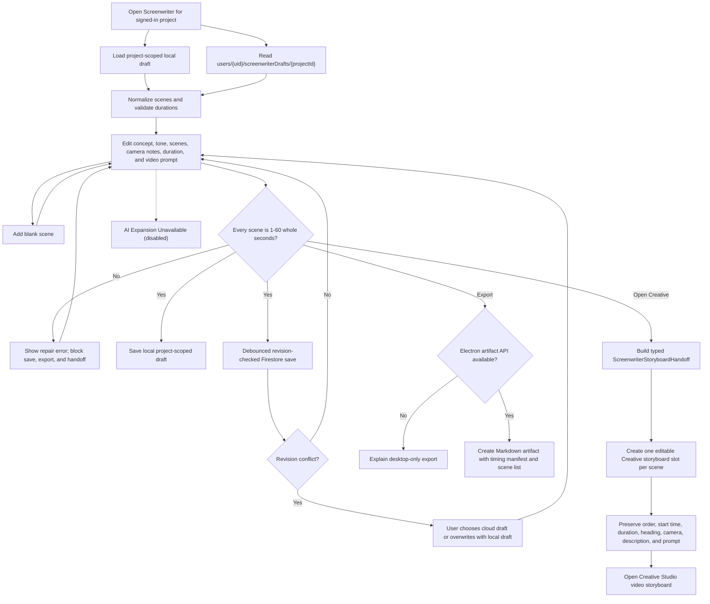

# Screenwriter & Storyboard Planner Flow

This diagram documents the behavior that exists today. The module is a manual
script/storyboard editor with local and Firestore draft persistence, Markdown
artifact export in Electron, and a structured handoff to Creative Studio. AI
scene expansion, audio analysis, generated storyboard images, PDF/share-link
export, and third-party editor sync are not connected.

## Step-by-Step Transition Breakdown

1. Opening Screenwriter requires a signed-in user and project. The module loads
   both the project-scoped local draft and
   `users/{uid}/screenwriterDrafts/{projectId}`, then normalizes the winning
   draft without hiding invalid legacy durations.
2. Editing changes only the draft state. Scene duration validation accepts
   whole seconds from 1 through 60; invalid scenes remain visible for repair and
   block save, export, and Creative handoff.
3. A valid draft is written locally and debounced to Firestore with its revision.
   If the stored revision changed, the user must explicitly load the cloud copy
   or overwrite it with the current local draft.
4. Desktop export sends a Markdown artifact containing the timing manifest and
   scene list through the Electron artifact API. Browser use fails closed with
   an availability explanation; it does not fabricate a PDF or hosted URL.
5. Creative handoff builds a typed `ScreenwriterStoryboardHandoff` and creates
   one editable `StoryboardProject` slot for every scene, preserving order,
   start time, duration, heading, camera notes, description, and video prompt.
6. Creative Studio opens the assembled storyboard, but rendering remains an
   explicit per-slot action. AI scene expansion, audio analysis, generated
   storyboard images, share-link export, and third-party editor sync remain
   visibly unavailable until real integrations exist.
