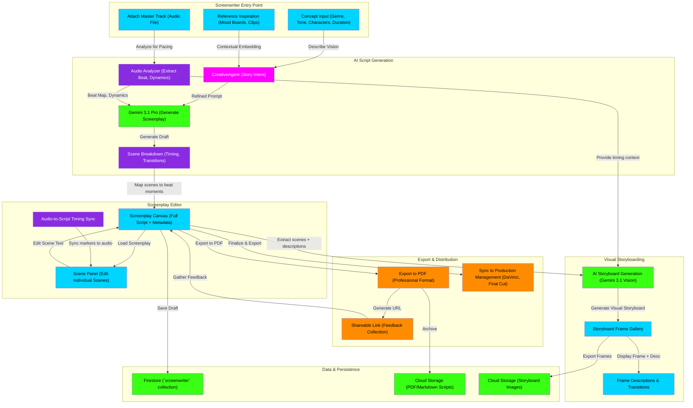

# Screenwriter & Script Generation Flowchart

This flowchart maps the **Screenwriter Module**—an AI-assisted screenplay generator for music video directors and film producers. It guides users from concept through final screenplay with scene breakdowns and video storyboards.

## Transition Breakdown

1. **Concept Input:** User describes the music video concept—genre, tone, characters, duration. They upload the master track and optionally provide reference mood boards or video clips.

2. **Audio Analysis:** The **Audio Analyzer** extracts tempo, beat map, dynamic peaks, and sections (intro, verse, chorus, bridge). This temporal metadata guides screenplay pacing.

3. **AI Screenplay Generation:** The **Creative Agent** synthesizes the user's concept with the audio analysis and generates a draft screenplay via **Gemini 3.1 Pro**. The output is a full script with scene numbers, action lines, and dialogue.

4. **Scene Breakdown:** The **Scene Breakdown** engine maps each scene to specific moments in the audio (e.g., "Scene 3 starts at 1:32 (kick drop)"). This ensures the visual pacing aligns with the music.

5. **Screenplay Editor:** User loads the draft into the **Screenplay Canvas**—a full-page editor for the complete script. The **Scene Panel** allows frame-by-frame editing of individual scenes, with **Audio-to-Script Timing Sync** markers pinned to beat moments.

6. **Storyboarding:** Once the screenplay is locked, the system **generates a visual storyboard** using **Gemini 3.1 Vision** (image generation). Each frame has a visual description, transitions, and camera direction tied to the audio.

7. **Storyboard Gallery:** User browses the **Frame Gallery**, adjusting visual directions (e.g., "Make the lighting more blue") and adding notes for the production team.

8. **Export & Feedback:** User exports to **PDF** (professional screenplay format) and generates a **Shareable Link** for feedback from collaborators. Comments are synced back to the script.

9. **Production Handoff:** The finalized screenplay and storyboards are exported and synced to video editing software (**DaVinci Resolve, Final Cut Pro**) with embedded timing references.

