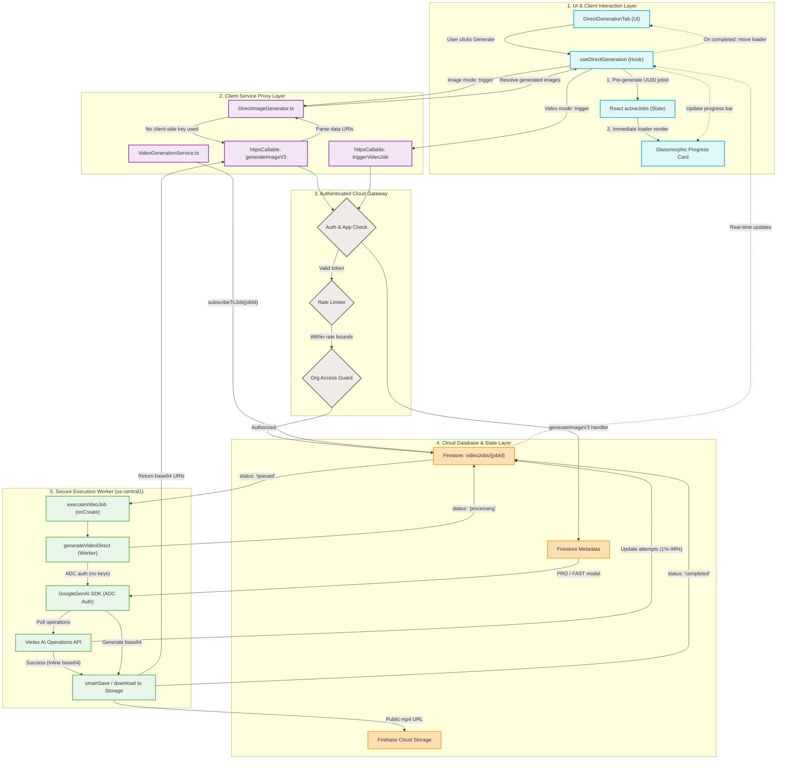

# Secure Generation Execution Isolation & Proxy Routing Flowchart

This flowchart visualizes the secure, production-grade architecture of the direct image and video generation pipelines in the **indii** studio. 

By eliminating client-side `@google/genai` calls and key exposures (`VITE_API_KEY`), all operations are routed through authenticated backend Cloud Function proxies (`generateImageV3` and `triggerVideoJob`). This decouples frontend rendering from high-cost AI operations and isolates execution security completely on the backend.

---

## Architecture Flowchart

---

## Detailed Transition Walkthrough

### 1. Job Allocation & Loader Instantiation (UI)
* **Trigger:** When the user clicks the "Generate" button within `DirectGenerationTab.tsx`, execution is delegated to the `useDirectGeneration` hook's handlers.
* **UX Optimistic Update:** A unique `jobId` is instantly allocated on the client side using `crypto.randomUUID()`. The hook pushes a mock job record with `{ id: jobId, status: 'queued', progress: 0 }` to the local React component state (`activeJobs`), which triggers the immediate visual rendering of a premium glassmorphic loader card in the canvas gallery.

### 2. Client-Side Proxy Service Call
* **Image Path:** The generator redirects the payload to `DirectImageGenerator.ts` which invokes `httpsCallable(functions, 'generateImageV3')`. It passes the prompt, aspect ratio, model tier, and configuration parameters.
* **Video Path:** The hook bypasses direct client-side generation and immediately invokes `httpsCallable(functions, 'triggerVideoJob')`. It formats the payload to strictly satisfy the server's `VideoJobSchema` rules, passing along `jobId`, the enriched timeline sequence prompt, resolutions, duration, and reference/ingredient byte structures.

### 3. Server-Side Security & Token Verification (Cloud Layer)
* **Auth & App Check:** The Cloud Function verifies that the Firebase ID token is valid and refreshed, blocking all unauthorized access. 
* **Rate Limiting:** The user's UID is checked against the server's redis/firestore rate-limit window to protect resources.
* **Organization Access:** The server verifies membership for any targeted organization, preventing IDOR/access injection attacks.

### 4. Asynchronous Background Execution (Worker Layer)
* **Firestore Trigger:** The `triggerVideoJob` function creates the primary job document under `videoJobs/{jobId}` with status `"queued"`. This triggers the long-running background Cloud Function trigger `executeVideoJob`.
* **Worker Execution:** The worker starts `generateVideoDirect()`, updating the job status to `"processing"` (which the client's live subscription receives immediately).
* **ADC Auth:** The worker instantiates the `@google/genai` client using server-side Application Default Credentials (ADC) without hardcoding or exposing keys.
* **Operations Polling:** The worker triggers `ai.models.generateVideos()` and queries the operations status loop every 10 seconds. In each loop, progress is calculated (`Math.min(99, Math.round((attempt / maxAttempts) * 100))`) and written back to Firestore, causing the client's glassmorphic progress bar to animate smoothly in real-time.
* **Cloud Storage Durable Sync:** On operation completion, the raw base64 video is fetched and securely uploaded to the public Firebase Cloud Storage bucket. The Firestore job status is set to `"completed"` alongside the durable Storage public URL.

### 5. Final UX Resolution
* **Subscription loop:** The client-side hook, which subscribed to `VideoGeneration.subscribeToJob(jobId)`, receives the `"completed"` Firestore snapshot.
* **Completion Handover:** The final URL propagates to Zustand store history, a success toast triggers, the loader card fades out, and the newly generated video asset loads seamlessly inside the media gallery.
