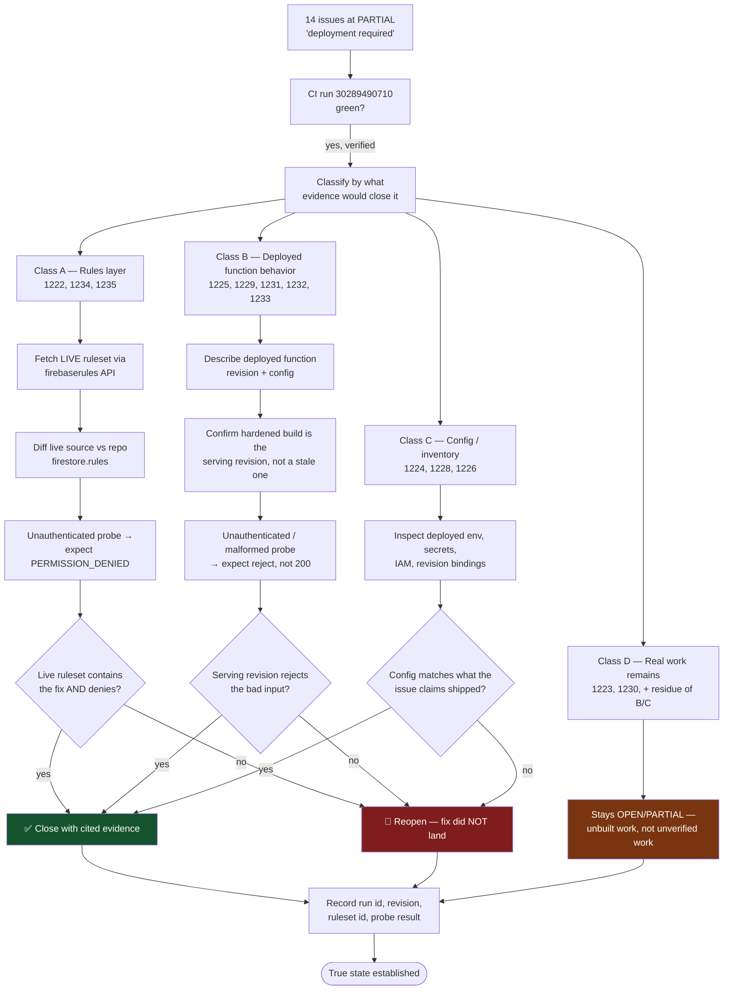

# Security Verification Sweep (ISSUE-1222→1235) — Macro Flow

**Generated:** 2026-07-27 via `/start` step 4
**Objective:** establish the *true* production state of 14 security/hardening issues logged 2026-07-26
**DoD contract:** Runtime Phase — live evidence or the issue stays open. No mocks, no seeded data, no
bypassed auth (`.agent/REAL_USER_AUTHENTICITY.md`).

## Why this sweep exists

All 14 entries recorded a remaining half worded "production deployment / live verification required."
Each was written as if deployment were merely *not yet attempted*. In fact it had been attempted
repeatedly and **failing since 2026-07-25** (ISSUE-1238: one function pinned below the Gen2 cold-start
memory floor failed the whole functions deploy step). CI went green on run `30289490710`, so their code
is now in production — but nobody has looked at whether the fixes actually behave correctly there.

The trap this sweep must avoid is the one that created it: **assuming state instead of measuring it.**
Every issue below either gets live evidence or keeps its 🟡 PARTIAL.

## Verification flow

## Transition Breakdown

1. Confirm the exact CI run and deployed revision before using production
   behavior as evidence for any issue.
2. Classify each partial issue by the layer that can prove it: live Rules,
   deployed function behavior, deployed configuration, or unfinished product
   work.
3. Fetch live Rules and compare them with the repository before running denial
   probes against the deployed project.
4. Inspect each serving function revision and submit only the previously
   accepted malformed input needed to prove the hardened rejection.
5. Read deployed environment, secret bindings, IAM, and revision configuration
   directly for inventory claims.
6. Close only issues whose required live evidence passes; reopen failed
   deployments and retain genuinely unbuilt work as open.
7. Record immutable run, revision, ruleset, and probe references in the active
   ledger without substituting mocks or impersonated sessions.

## Evidence standard per class

| Class | Issues | Evidence that closes it | Evidence that does NOT |
|---|---|---|---|
| A — Rules | 1222, 1234, 1235 | Live ruleset fetched from the `firebaserules` API contains the corrected match block, **and** a real unauthenticated/cross-scope probe returns `PERMISSION_DENIED` | Repo file contents; emulator-only proof (that was already done on 2026-07-26 and is what left these PARTIAL) |
| B — Function behavior | 1225, 1229, 1231, 1232, 1233 | The *serving* revision is the hardened build, and a probe carrying the previously-accepted bad input is rejected | "It deployed" — a successful deploy proves the container starts, not that the guard works |
| C — Config/inventory | 1224, 1228, 1226 | Deployed env vars / secret bindings / revision inspected directly and matching the claim | The value in `deploy.yml` — CI config is intent, the live revision is fact (this exact gap is ISSUE-1238's lesson) |
| D — Unbuilt | 1223, 1230 | Nothing — the remaining half is unimplemented work (desktop attestation; authenticated emulator contract lane), not unverified work | Any amount of verification |

## Hard constraint discovered before starting

Minting a Firebase ID token for an arbitrary uid needs `iam.serviceAccounts.signBlob`, which is **not
granted** (it was granted temporarily on 2026-07-24 and revoked). That blocks *authenticated positive-path*
probes — "a legitimate user can still do the allowed thing."

It does **not** block the security-relevant direction, which is the one that matters here: proving the
system **denies** what it should deny, and proving the **deployed artifact is the hardened one**. Both are
reachable with the operator's existing `gcloud` credentials. Where a positive-path check is genuinely
required to close an issue, that is recorded as the remaining gap rather than worked around — the
authenticity rule forbids substituting a bypassed or impersonated session for a real one.

## Non-goals

- Not re-doing the 2026-07-26 emulator proofs. They exist and are not in dispute; they are precisely
  what was insufficient to close these.
- Not lowering the ISSUE-1227 detector score. Separate program, separate acceptance.
- Not touching the concurrent agent's uncommitted work in `SecuritySection.tsx` / `CostControlService.ts`.
