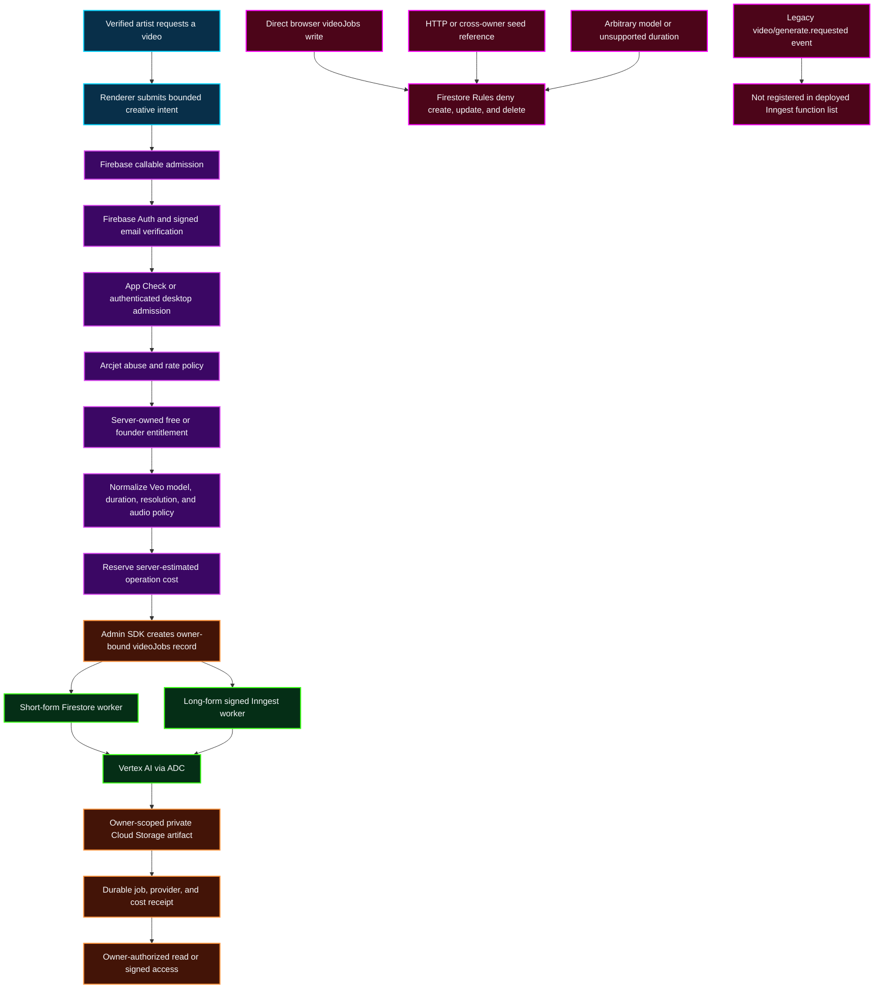

# Server-Only Video Generation Security Flow

This map documents the authoritative short-form and long-form video paths. It
separates browser intent from server-owned identity, entitlement, cost,
provider execution, and private artifact delivery.

## Transition Breakdown

1. The renderer sends creative intent only. Browser-supplied user IDs and job
   IDs are not authoritative.
2. The callable derives the artist identity from Firebase Auth, requires the
   verified-account admission contract, applies App Check or the authenticated
   desktop contract, and evaluates Arcjet policy.
3. The backend resolves the server-owned entitlement and normalizes the
   requested model and duration before calculating cost. The same normalized
   values are persisted for the worker, preventing billing/provider drift.
4. A server-created reservation precedes the Admin SDK `videoJobs` write.
   Firestore Rules deny direct client mutation of worker-triggering documents.
5. Short-form jobs execute through the Firestore worker; long-form jobs execute
   through the signed Inngest path. Both use Vertex AI with Application Default
   Credentials and no browser provider key.
6. Provider submission evidence is persisted before a billable call. Failures
   settle or void the reservation based on whether provider work may have
   started.
7. Generated videos remain private, owner-scoped Cloud Storage objects. The job
   stores a `gs://` artifact reference; an authorized service must mediate
   customer access.
8. Arbitrary remote seed URLs, cross-owner Storage references, unsupported
   models, unsupported durations, and direct browser job writes fail closed.
   The obsolete single-video Inngest event is not registered for execution.
