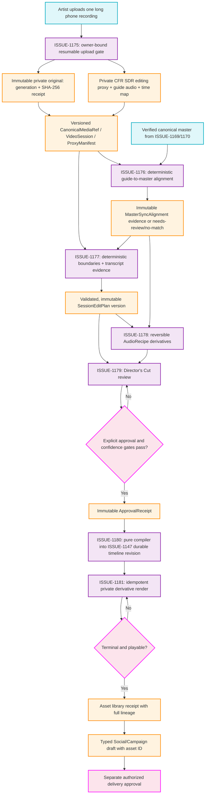

# Session Breakdown Roadmap

This map captures the required delivery sequence for ISSUE-1175 through ISSUE-1181. It is a planning artifact only: the active ledger remains the source of truth for requirements and closure evidence.

## Current implementation boundary (updated 2026-07-25)

- ISSUE-1175 has a deployed foundation: versioned media/session/proxy contracts, owner-bound resumable staging, immutable generation/hash finalization, cancellation receipts, private Firestore/Storage rules, renderer upload orchestration, and a fixture-tested FFmpeg proxy pipeline.
- **Worker queue/persistence is now durable** (`dispatchSessionProxyJob.ts`, repair-order step 2): the finalizer dispatches exactly one idempotent Cloud Tasks job per finalized original, double-guarded (transactional claim + deterministic task name) against the finalizer's own `retry: true`.
- **The proxy worker is production-bound** (repair-order step 3, `packages/engine-dsp/video_session_pipeline.py` + `POST /proxy`): the mainline deployment verifies the Cloud Tasks queue, grants the private runtime least-privilege object access, deploys Cloud Run with explicit CPU/memory/concurrency/timeout settings, and supplies the dispatcher environment. The worker re-verifies persisted session and immutable original identities, produces private generation-pinned derivatives, and commits a schema-exact `ProxyManifest` only while it owns the lease.
- Cost reservations now have deterministic operation identities and terminal settlement/voiding. Retention deletes staging and eligible derivatives, preserves immutable originals, honors explicit dependency receipts, and uses a bounded fail-closed legacy timeline scan.
- Creative Video now exposes an owner/project-bound long-recording panel with resumable browser uploads, pause/resume/cancel controls, durable session recovery, terminal retry identity, live status, and proxy opening.
- ISSUE-1175 remains **OPEN/PARTIAL**. The code and deterministic deployment path are complete, but strict closure still requires one authenticated production recording to prove upload → immutable original → queued worker → terminal manifest → playable proxy, plus representative real rotated/VFR/HEVC/HDR phone fixtures. Unit, emulator, and synthetic FFmpeg evidence do not substitute for those criteria.
- ISSUE-1176 through ISSUE-1181 remain **OPEN and unstarted**. The dependency gate below remains authoritative; no later issue may bypass unfinished ISSUE-1175 evidence — unit tests over Zod schemas do not close any of them; only a real end-to-end artefact does.

## Transition Breakdown

1. ISSUE-1175 establishes the only acceptable source identity: a private, immutable original and a derived proxy manifest with a deterministic presentation-time map. Later work must consume these receipts rather than an opaque client URL.
2. ISSUE-1176 compares the ISSUE-1175 guide derivative with the independently verified canonical master. Its output is durable alignment evidence or an honest review/no-match state, never a fabricated offset.
3. ISSUE-1177 combines deterministic boundaries and transcription evidence with bounded semantic classification. The persisted plan remains an immutable recommendation, preserving every source range.
4. ISSUE-1178 creates reproducible, reversible audio derivatives only. It never replaces original, guide, or master media.
5. ISSUE-1179 is the human control point. Its approval receipt binds exact source/master generations, plan and alignment versions, and user decisions. Analysis completion cannot cross this boundary automatically.
6. ISSUE-1180 is the first path allowed to create a durable timeline revision. It must reuse ISSUE-1147 persistence and preserve the same range, map, sync-lock, and audio semantics in preview and protected final rendering.
7. ISSUE-1181 may create private terminal/playable derivatives and typed handoff drafts. A separate explicit delivery action is still required for scheduling or posting.
