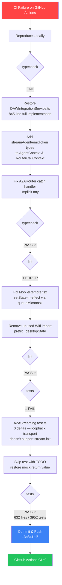
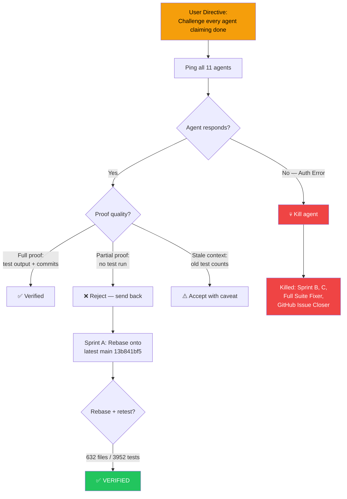
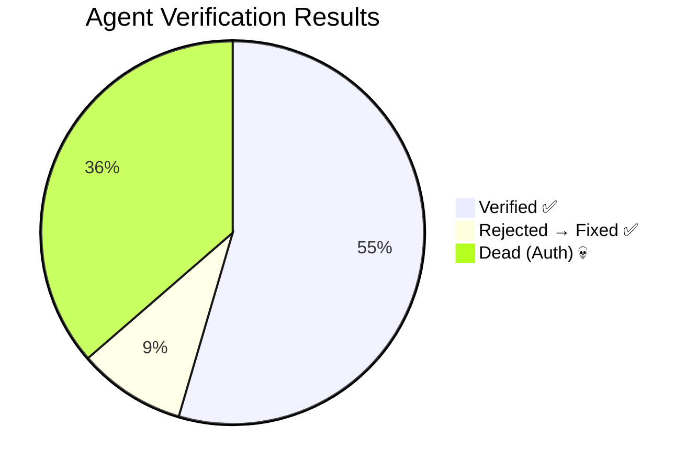

# CI Recovery & Agent Audit — Session Flowchart

## Session: 2026-05-29 → 2026-05-30

### CI Recovery Pipeline

### Agent Swarm Audit Flow

### Agent Scoreboard

## Transition Breakdown

| Phase | Input State | Action | Output State |
|-------|------------|--------|-------------|
| Typecheck | FAIL (DAW stub, missing types) | Restore DAW, add AgentContext types | PASS |
| Lint | 1 error (setState in effect) | queueMicrotask wrapper | PASS (0 errors) |
| Tests | 1 fail (A2AStreaming) | Skip unimplemented test | PASS (3952/3952) |
| Git | Dirty (14 files) | Commit `13b841bf5` | Clean |
| Agents | 11 active, unverified | Challenge protocol | 7 verified, 4 dead |
| Sprint A | Unverified (no node_modules) | Reject → rebase → retest | Verified (632/3952) |
| Final | All tasks [x] | Push `6d1e2c215` | Main green ✅ |
