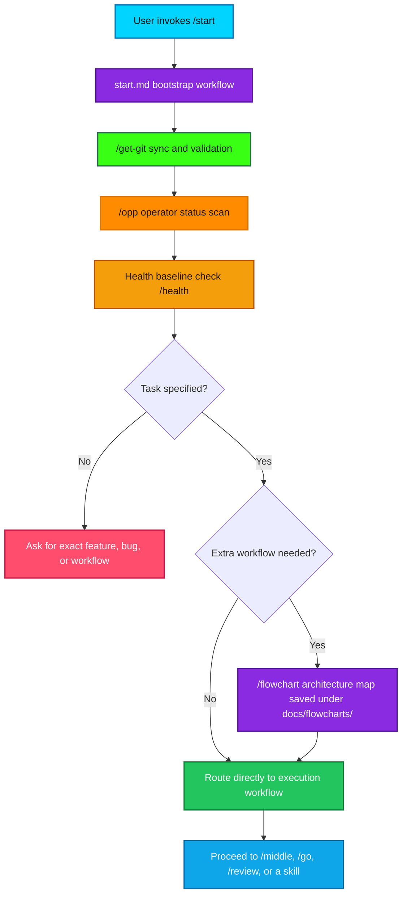

# Session Start Bootstrap & Routing

This flowchart captures the repo-local `/start` initialization path for a fresh session: sync git state, scan the operator context, note the current health-baseline limitation, and route into the next concrete task or workflow.

## Transition Breakdown

1. The session begins when the user issues `/start`, which activates the repo-local bootstrap workflow in `.agent/workflows/start.md`.
2. `/get-git` runs first so the branch state, remote sync state, and validation posture are known before any task work begins.
3. `/opp` then captures the operator snapshot: branch, clean/dirty status, recent commits, workflow inventory, handoff artifacts, error patterns, and memory presence.
4. The health baseline step is recorded as a manual/planned check in this repo, so the chart preserves the intent without pretending there is an automated `/health` implementation here.
5. If the user's request is still underspecified after the bootstrap scan, the session pauses and asks for the exact feature, bug, or workflow to pursue.
6. If the request is clear, the session checks whether another workflow is needed, such as `/review`, `/middle`, `/go`, or a domain skill.
7. If architecture mapping is needed, `/flowchart` writes the current strategy diagram into `docs/flowcharts/` before execution continues.
8. Once routing is settled, the session hands off into the next execution surface and proceeds with the concrete task instead of staying in bootstrap mode.
