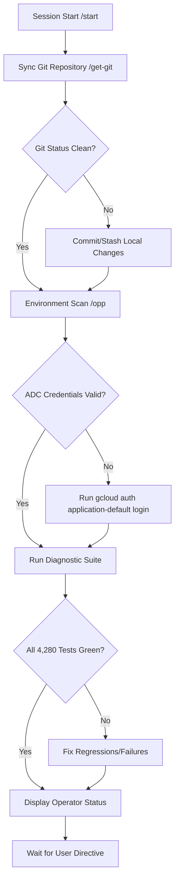

# Session Start Context & Environment Verification Flow

This flowchart maps the initialization sequence when starting a new session or feature development.

## Transition Breakdown
1. **Sync Git Repository (`/get-git`):** Fetches the latest remote changes and checks if the local repository is in sync.
2. **Environment Scan (`/opp`):** Audits current workspace state, handoff logs, and error ledger.
3. **ADC Credentials Verification:** Confirms whether Application Default Credentials (ADC) are valid. If not, prompts the developer to log in using the `gcloud` CLI.
4. **Diagnostic Suite Execution:** Runs unit tests, API tests, and cloud function connection probes.
5. **Status Verification:** Checks that all test shards are green before displaying the final Operator Status report and awaiting user commands.
