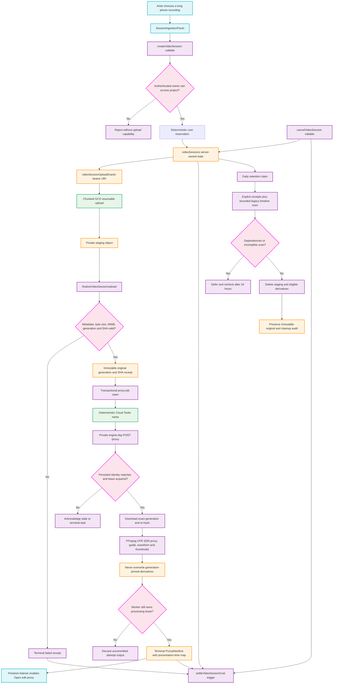

# Session Breakdown and Long-Form Video Pipeline

This diagram is the definitive ISSUE-1175 implementation path. It maps the owner/project authorization boundary, resumable upload capability, immutable original receipt, idempotent Cloud Tasks dispatch, private proxy worker, cost settlement, and dependency-aware retention. Later ISSUE-1176 through ISSUE-1181 work may consume the terminal manifest but may not bypass these gates.

## Transition Breakdown

1. `SessionIngestionPanel.tsx` derives a stable resume identity from the authenticated owner, organization, project, and file fingerprint. A cancelled or failed session adds a fresh attempt UUID so the same local file can start a new durable session instead of replaying a terminal one.
2. `createVideoSession.ts` validates the request, authorizes the root project or organization membership, reserves the estimated processing cost under `video-session-{sessionId}`, creates server-owned session state, and returns a private GCS resumable URI. Firestore rules deny every client read of that bearer URI.
3. `SessionVideoUploadService.ts` queries the server-confirmed committed offset, sends aligned chunks, and re-queries after pause interruption. The browser never selects its own Storage path or identity metadata.
4. `finalizeVideoSessionUpload.ts` accepts only the authorized staging path and exact metadata, MIME type, byte size, and generation. It hashes the observed bytes, copies them to a never-overwrite content-addressed original path, and persists the immutable receipt.
5. `dispatchSessionProxyJob.ts` uses a Firestore claim plus a deterministic Cloud Tasks task name. The claim transitions from `dispatching` to `queued` only after task acceptance, so both redelivery and a claim-then-crash remain idempotent.
6. `video_session_pipeline.py` checks the task payload against the persisted session, original receipt, and proxy claim before acquiring a lease. It re-downloads the exact Storage generation, verifies SHA-256, runs FFmpeg, and uploads job-scoped private artifacts with create-only preconditions.
7. The worker commits `ProxyManifest` only if it still owns the processing lease. Cancellation removes that attempt's derivatives; a newer lease or completed attempt remains authoritative and cannot be overwritten.
8. `settleVideoSessionCost.ts` settles completed sessions and voids failed or cancelled sessions through an idempotent ledger transition. Active long-running sessions are not refunded by the generic stale-reservation sweeper.
9. `cleanupVideoSessions.ts` preserves immutable originals. It deletes staging and eligible derivatives only after checking server-owned dependency receipts and at most 100 legacy timelines; an incomplete scan fails closed and schedules a 24-hour recheck.
10. ISSUE-1176 may begin only from the terminal `ProxyManifest` and immutable canonical master. Production ISSUE-1175 closure still requires a real authenticated recording to traverse the entire diagram and yield a playable proxy.
