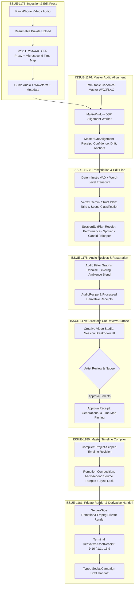

# Session Breakdown & Long-Form Video Pipeline Architecture

> **Governing Directive:** Sequentially execute ISSUE-1175 $\rightarrow$ ISSUE-1176 $\rightarrow$ ISSUE-1177 $\rightarrow$ ISSUE-1178 $\rightarrow$ ISSUE-1179 $\rightarrow$ ISSUE-1180 $\rightarrow$ ISSUE-1181.

## Execution Sequence & Contract Guards

1. **ISSUE-1175 (Ingestion & Proxy)**: Establishes `CanonicalMediaRef`, `VideoSession`, and `ProxyManifest`.
2. **ISSUE-1176 (Master Alignment)**: Establishes `MasterSyncAlignment` anchored to `MasterTimingProfile`.
3. **ISSUE-1177 (Edit Plan)**: Establishes `SessionEditPlan` classifying performance/spoken/candid/bloopers without auto-deleting.
4. **ISSUE-1178 (Audio Recipes)**: Establishes `AudioRecipe` profiles (Natural, Clean, Studio, Rescue) and ambience ducking.
5. **ISSUE-1179 (Director's Cut UI)**: Establishes `ApprovalReceipt` binding user decisions to plan/sync/media generations.
6. **ISSUE-1180 (Timeline Compiler)**: Compiles `ApprovalReceipt` into project-scoped `videoEditorStore` timeline clips.
7. **ISSUE-1181 (Derivative Handoff)**: Produces terminal `DerivativeAssetReceipt` records and typed Social/Campaign drafts.
