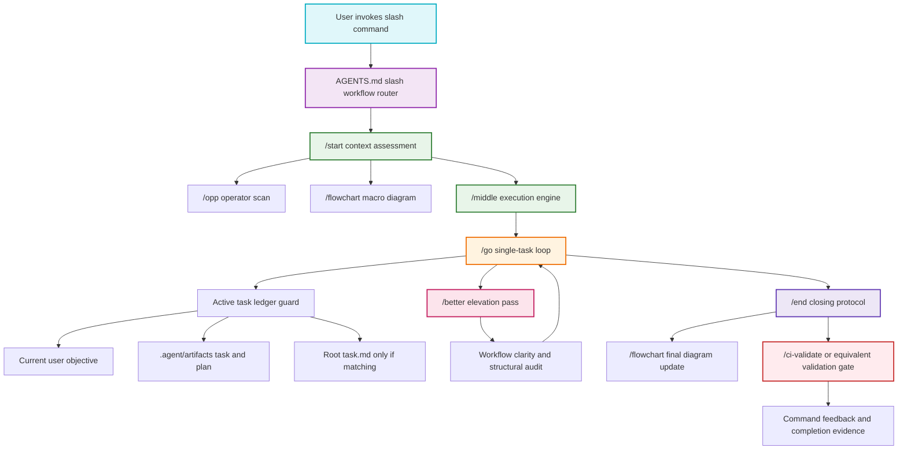

# Slash Command Operating Loop

This flowchart maps how the local slash-command workflow files coordinate a normal agent session: initialization, execution, elevation, final verification, and feedback.

## Transition Breakdown

1. A user command is routed through `AGENTS.md`, which points slash commands to `.agent/workflows/`.
2. `/start` performs the beginning-of-session classification and calls `/opp` for repo, handoff, memory, workflow, and dependency awareness.
3. `/start` also requires a saved `/flowchart` artifact, so this document records the macro command flow.
4. `/middle` takes over during active execution and delegates one concrete task at a time to `/go`.
5. `/go` now checks for stale task ledgers before using root `task.md` or `implementation_plan.md`, preventing unrelated old work from steering the session.
6. `/better` audits the current target through structural and clarity lenses, then feeds safe workflow fixes back into `/go`.
7. `/end` verifies the current objective, records closing evidence, updates architecture diagrams when needed, and calls the final validation path.
8. The session closes with explicit feedback and command-by-command evidence instead of relying on broad claims.
